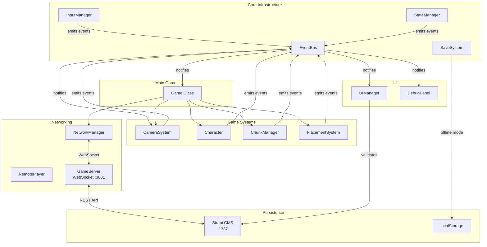
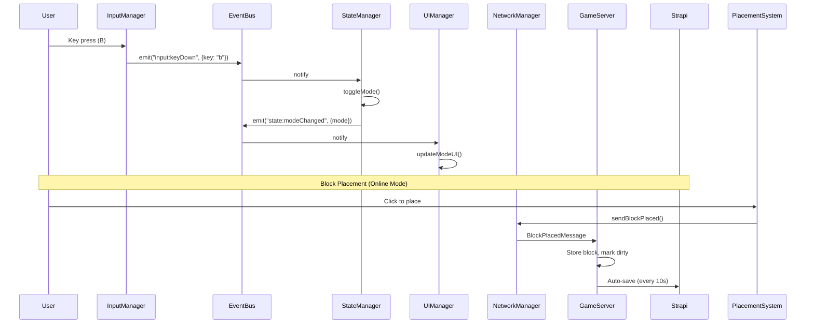
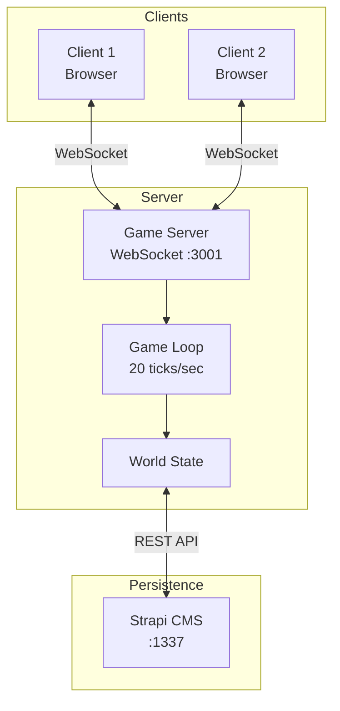
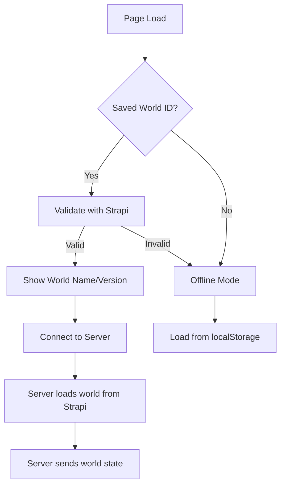
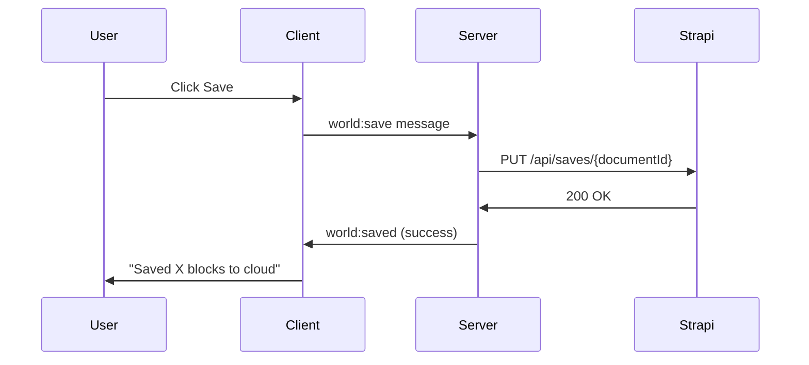
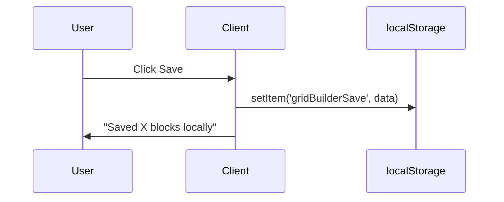
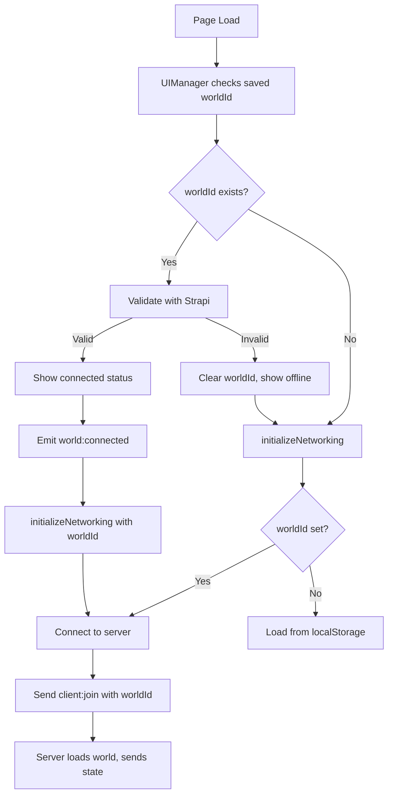

# Grid Builder - Architecture Documentation

This document provides a comprehensive overview of the systems implemented in this Three.js grid-based builder game. Each system is explained with its purpose, logic flow, and code examples to help you implement similar features in your own projects.

## Table of Contents

1. [Project Overview](#project-overview)
2. [System Architecture](#system-architecture)
3. [Core Systems](#core-systems)
   - [EventBus](#eventbus)
   - [InputManager](#inputmanager)
   - [StateManager](#statemanager)
4. [Game Systems](#game-systems)
   - [Grid System](#grid-system)
   - [Camera System](#camera-system)
   - [Character System](#character-system)
   - [Structure Placement System](#structure-placement-system)
   - [Material System](#material-system)
   - [Prefab Capture System](#prefab-capture-system)
5. [Networking & Multiplayer](#networking--multiplayer)
   - [Architecture Overview](#architecture-overview)
   - [NetworkManager](#networkmanager)
   - [Network Protocol](#network-protocol)
   - [Remote Players](#remote-players)
   - [Game Server](#game-server)
6. [World Persistence](#world-persistence)
   - [World Connection System](#world-connection-system)
   - [Online vs Offline Mode](#online-vs-offline-mode)
   - [Strapi Integration](#strapi-integration)
   - [Save/Load Flow](#saveload-flow)
7. [UI System](#ui-system)
   - [UIManager](#uimanager)
   - [World Status UI](#world-status-ui)
   - [DebugPanel](#debugpanel)
8. [Performance Optimizations](#performance-optimizations)
9. [Collision Detection](#collision-detection)
10. [Game Loop](#game-loop)
11. [Adding New Features](#adding-new-features)

---

## Project Overview

This is a SimCity/Minecraft-style grid builder with:
- Infinitely expanding chunk-based world (exploration dictates world size)
- **Multiplayer support** with server-authoritative movement
- **World persistence** via Strapi CMS with offline fallback
- Third-person and first-person camera modes with right-click camera rotation
- Click-to-move character with collision detection and waypoint queuing
- 3D stackable building blocks with manual level control
- Material system with PBR properties (roughness, metalness, emissive)
- Pre-built prefab structures (column, sphere, pyramid) with rotation
- Prefab capture system to save custom builds
- Drag-to-place and drag-to-delete for fast building
- Grid snapping and structure rotation
- Level indicator grid showing current build height
- Wireframe toggle and material visibility toggle
- Fog system to hide world edges during exploration
- Event-driven modular architecture
- **High-performance instanced rendering** (50,000+ blocks at 60fps)
- Debug panel for real-time event monitoring

### File Structure

```
src/
├── main.ts                      # Game bootstrap and orchestration
├── style.css                    # UI styling
├── core/                        # Core infrastructure
│   ├── EventBus.ts             # Pub/sub event system
│   ├── InputManager.ts         # Centralized input handling
│   ├── StateManager.ts         # Game state management
│   ├── PlayerState.ts          # Serializable player state
│   ├── PlayerController.ts     # Local player movement
│   └── SaveSystem.ts           # Save/load with Strapi & localStorage
├── systems/                     # Game systems
│   ├── CameraSystem.ts         # Unified camera (3rd/1st person)
│   ├── SceneConfig.ts          # Fog and scene environment settings
│   └── PrefabCaptureSystem.ts  # Capture placed blocks as prefabs
├── entities/
│   ├── Character.ts            # Player character with movement
│   └── RemotePlayer.ts         # Remote player visual + interpolation
├── grid/
│   └── ChunkManager.ts         # Dynamic chunk-based world generation
├── structures/
│   ├── BlockData.ts            # Block definitions with materials & Strapi loader
│   ├── StructureDefinition.ts  # Structure shapes and data (converts BlockData)
│   ├── PrefabData.ts           # Strapi-compatible prefab definitions & loader
│   ├── PrefabDefinition.ts     # Internal prefab format (converts PrefabData)
│   └── PlacementSystem.ts      # Placement with instanced rendering
├── network/
│   ├── NetworkProtocol.ts      # Shared message types for client/server
│   └── NetworkManager.ts       # Client-side WebSocket handler
└── ui/
    ├── UIManager.ts            # UI updates, world connection modal
    └── DebugPanel.ts           # Real-time event debugging

server/
└── GameServer.ts               # WebSocket game server with Strapi integration

docs/
├── architecture.md              # This file - system documentation
├── multiplayer-architecture.md  # Detailed multiplayer implementation
└── performance-optimizations.md # Detailed performance guide
```

---

## System Architecture

The architecture follows an **event-driven pattern** where systems communicate through a central EventBus rather than direct method calls. This provides:

- **Loose coupling**: Systems don't need direct references to each other
- **Extensibility**: New systems can subscribe to existing events
- **Testability**: Systems can be tested in isolation
- **Maintainability**: Changes to one system don't ripple through others
- **Debuggability**: All events can be monitored via DebugPanel



### Data Flow



---

## Core Systems

### EventBus

The EventBus provides a publish/subscribe pattern for decoupled communication between systems.

```typescript
// src/core/EventBus.ts

// Subscribe to an event
const subscription = eventBus.on("player:moved", (data) => {
  console.log(`Player moved to ${data.x}, ${data.z}`);
});

// Emit an event
eventBus.emit("player:moved", { x: 10, z: 20 });

// Unsubscribe
subscription.unsubscribe();

// Type-safe helpers
import { onEvent, emitEvent } from "./core/EventBus";

onEvent("state:modeChanged", ({ mode }) => {
  // TypeScript knows 'mode' is "move" | "build"
});

emitEvent("state:modeChanged", { mode: "build" });
```

**Defined Event Types:**

| Event | Data | Emitted By | Description |
|-------|------|------------|-------------|
| `state:modeChanged` | `{ mode }` | StateManager | Game mode changed (move/build) |
| `state:viewModeChanged` | `{ viewMode, previous }` | StateManager | Camera view changed |
| `state:freePlacementChanged` | `{ enabled }` | StateManager | Free placement toggled |
| `state:prefabCaptureChanged` | `{ active }` | StateManager | Prefab capture mode toggled |
| `state:renderModeChanged` | `{ renderMode }` | StateManager | Wireframe mode toggled |
| `state:showMaterialsChanged` | `{ show }` | StateManager | Material visibility toggled |
| `input:click` | `{ worldX, worldZ, gridX, gridZ, worldY, gridY }` | InputManager | Left click on grid |
| `input:rightClick` | `{ worldX, worldZ, gridX, gridZ }` | InputManager | Right click on grid |
| `input:keyDown` | `{ key }` | InputManager | Key pressed |
| `input:keyUp` | `{ key }` | InputManager | Key released |
| `character:destinationSet` | `{ x, z }` | Character | Movement target set |
| `character:waypointQueued` | `{ x, z, queuePosition }` | Character | Waypoint added to queue |
| `character:moved` | `{ x, z }` | Character | Position updated (per frame) |
| `character:arrivedAtDestination` | `{ x, z }` | Character | Reached destination |
| `character:collided` | `{ x, z }` | Character | Hit a structure |
| `structure:placed` | `{ id, gridX, gridZ }` | PlacementSystem | Structure placed |
| `structure:removed` | `{ id, gridX, gridZ }` | PlacementSystem | Structure removed |
| `structure:selected` | `{ structureId }` | StateManager | Structure type selected |
| `structure:rotated` | `void` | PlacementSystem | Preview rotated |
| `structure:placementCancelled` | `void` | StateManager | Placement cancelled |
| `structure:levelChanged` | `{ level, maxLevel }` | PlacementSystem | Build level changed |
| `prefab:selected` | `{ prefabId }` | UIManager | Prefab selected for placement |
| `prefabCapture:selectionComplete` | `{ blockCount }` | PrefabCaptureSystem | Capture selection finished |
| `prefabCapture:saved` | `{ prefabId, name }` | UIManager | Prefab saved successfully |
| `prefabCapture:cancelled` | `void` | UIManager | Prefab capture cancelled |
| `camera:moved` | `{ x, z }` | CameraSystem | Camera position updated |
| `chunk:generated` | `{ chunkX, chunkZ }` | ChunkManager | New chunk generated |
| `world:connected` | `{ worldId }` | UIManager | Connected to Strapi world |
| `world:disconnected` | `void` | UIManager | Disconnected from world |
| `game:saved` | `{ blockCount, timestamp }` | Game | World saved |
| `game:loaded` | `{ blockCount, timestamp }` | Game | World loaded |
| `game:reset` | `void` | Game | World reset |

### InputManager

Centralizes all input handling with action mapping. Converts raw input (keys, mouse) to game actions.

```typescript
// src/core/InputManager.ts

export class InputManager {
  // Check if an action is currently active (key held)
  isActionActive(action: InputAction): boolean;

  // Set custom key binding
  setKeyBinding(key: string, action: InputAction): void;
}

// Action types
type InputAction =
  | "moveForward" | "moveBackward" | "moveLeft" | "moveRight"
  | "rotateLeft" | "rotateRight"
  | "toggleBuildMode" | "rotateStructure"
  | "cancel" | "toggleViewMode"
  | "levelUp" | "levelDown"
  | "jetpackUp" | "jetpackDown";

// Default bindings
const DEFAULT_KEY_BINDINGS = {
  w: "moveForward",
  s: "moveBackward",
  a: "moveLeft",
  d: "moveRight",
  q: "rotateLeft",
  e: "rotateRight",
  b: "toggleBuildMode",
  r: "rotateStructure",
  escape: "cancel",
  v: "toggleViewMode",
  "[": "levelDown",
  "]": "levelUp",
  space: "jetpackUp",
  c: "jetpackDown",
};
```

### StateManager

Single source of truth for game state. Manages modes and emits events on changes.

```typescript
// src/core/StateManager.ts

import { stateManager } from "./core/StateManager";

// Get current state
const mode = stateManager.getMode();           // "move" | "build"
const viewMode = stateManager.getViewMode();   // "third-person" | "first-person"
const isPlacing = stateManager.isPlacing();    // boolean
const renderMode = stateManager.getRenderMode(); // "solid" | "wireframe"
const showMaterials = stateManager.getShowMaterials(); // boolean

// Mode management
stateManager.setMode("build");
stateManager.setViewMode("first-person");
stateManager.toggleMode();
stateManager.selectStructure("l_shape");
stateManager.cancelPlacement();

// Free placement mode (allows overlapping blocks)
stateManager.toggleFreePlacement();
stateManager.isFreePlacement();  // boolean

// Prefab capture mode
stateManager.togglePrefabCaptureMode();
stateManager.isPrefabCaptureMode();  // boolean

// Render mode toggles
stateManager.toggleRenderMode();     // Wireframe on/off
stateManager.toggleShowMaterials();  // Material properties on/off
```

**State Types:**

```typescript
type GameMode = "move" | "build";
type ViewMode = "third-person" | "first-person";
type RenderMode = "solid" | "wireframe";
```

---

## Game Systems

### ChunkManager (World Generation)

Creates an infinitely expanding world using chunk-based generation. New chunks are generated as the player explores, similar to Minecraft's world generation.

**Key Concepts:**
- Chunks are 32x32 cells (configurable)
- Render distance determines how many chunks to load around player (default: 3)
- Chunks are stored in a Map and never regenerated once created
- Checkered texture maintains visual continuity across chunk boundaries
- **Shared resources** - All chunks share the same grid geometry and material for performance
- Emits `chunk:generated` event when new chunks are created

**Configuration:**

```typescript
interface ChunkConfig {
  chunkSize: number;      // Cells per chunk (default: 32)
  cellSize: number;       // World units per cell (default: 1)
  renderDistance: number; // Chunks to load around player (default: 3)
  lightColor: number;     // Checkerboard light color
  darkColor: number;      // Checkerboard dark color
  gridColor: number;      // Grid line color
}
```

### Camera System

Unified camera handling for both third-person and first-person modes with advanced controls.

**Third-Person Features:**
- Fixed pitch (45°) with rotatable yaw (Q/E keys)
- **Right-click drag** to rotate camera (yaw and pitch)
- WASD pans with offset from character
- Smooth interpolation (lerp)
- Mouse wheel zoom (up to 120 units distance)

**First-Person Features:**
- Pointer lock for mouse look
- WASD movement relative to facing direction
- **Sprint mode** (hold Shift for 2.6x speed)
- Collision detection
- Eye height matches character head

### Character System

Click-to-move entity with waypoint queue, path visualization, collision detection, and event emission.

**Waypoint Queue System:**
- Supports up to 5 waypoints total (1 current destination + 4 queued)
- Click while moving to add waypoints to the queue
- Character visits each waypoint in order
- Visual feedback: green marker for current destination, yellow markers for queued waypoints

### Structure Placement System

Handles structure definitions, preview, validation, 3D placement/removal, and event emission. Supports stackable building blocks with manual level control.

**3D Placement System:**

The placement system tracks occupied cells in 3D space (x, y, z) and maintains a height map for each (x, z) position:

```typescript
interface PlacedStructure {
  id: string;
  definition: StructureDefinition;
  gridX: number;
  gridY: number;  // Y level (0 = ground, 1 = first stack, etc.)
  gridZ: number;
  mesh: THREE.Group;
}

// 3D occupancy tracking
private occupiedCells: Set<string>;  // Uses cellKey3D(x, y, z)
private heightMap: Map<string, number>;  // Max height at each (x, z)
```

**Manual Level Control:**
- `]` or `PageUp` - Increase build level
- `[` or `PageDown` - Decrease build level
- Max build height: 50 levels

### Material System

Blocks can have customizable PBR (Physically Based Rendering) materials:

```typescript
interface BlockMaterial {
  type?: "standard" | "phong" | "basic" | "lambert";
  roughness?: number;        // 0-1, how rough the surface is
  metalness?: number;        // 0-1, how metallic the surface is
  emissive?: string;         // Hex color for glow
  emissiveIntensity?: number; // Glow strength
  opacity?: number;          // 0-1, transparency
  transparent?: boolean;     // Enable transparency
  flatShading?: boolean;     // Faceted look
  wireframe?: boolean;       // Show as wireframe
  side?: "front" | "back" | "double";
}
```

### Prefab Capture System

Allows players to select placed blocks and save them as reusable prefabs.

**How It Works:**
1. Press P or click Capture button to enter capture mode
2. Use [ ] to set capture level
3. Click to select blocks at level
4. Press P again to finish
5. Enter name, description, category in save modal
6. Save to Strapi or locally
7. Prefab appears in menu

---

## Networking & Multiplayer

### Architecture Overview

The multiplayer system uses a **client-server architecture** with **server-authoritative movement**:

- The server is the single source of truth for game state
- Clients send inputs to the server (not positions)
- Server calculates positions and broadcasts to all clients
- Clients interpolate remote player positions for smooth movement
- World state is persisted to Strapi CMS



### NetworkManager

Client-side WebSocket handler that manages server communication:

```typescript
// src/network/NetworkManager.ts

export interface NetworkManagerConfig {
  serverUrl: string;
  worldId?: string;  // Strapi world ID to join
  onConnected?: (playerId: string, color: string, state: PlayerState) => void;
  onDisconnected?: () => void;
  onJoinError?: (message: string) => void;
  onPlayerJoined?: (player: NetworkPlayer) => void;
  onPlayerLeft?: (playerId: string) => void;
  onPlayerStateUpdate?: (playerId: string, state: PlayerState, timestamp: number) => void;
  onBlockPlaced?: (playerId: string, block: NetworkBlock) => void;
  onBlockRemoved?: (playerId: string, x: number, y: number, z: number) => void;
  onWorldState?: (blocks: NetworkBlock[], players: NetworkPlayer[]) => void;
  onWorldReset?: (playerId: string) => void;
  onWorldSaved?: (success: boolean, message?: string) => void;
}
```

**Key Methods:**

```typescript
// Connect to server
networkManager.connect();

// Disconnect (prevents auto-reconnect)
networkManager.disconnect();

// Update input state (called every frame)
networkManager.updateInputs({
  moveForward: true,
  sprint: false,
  // ...
});

// Send camera yaw for movement calculation
networkManager.setCameraYaw(cameraYaw);

// Block operations
networkManager.sendBlockPlaced(block);
networkManager.sendBlockRemoved(x, y, z);

// World operations
networkManager.sendWorldReset();
networkManager.sendWorldSave();
```

### Network Protocol

All messages are JSON-serializable with a `type` discriminator:

```typescript
// Client -> Server
interface ClientJoinMessage {
  type: "client:join";
  worldId: string;  // Strapi document ID
}

interface PlayerInputMessage {
  type: "player:input";
  playerId: string;
  inputs: PlayerInputs;
  timestamp: number;
}

interface WorldSaveRequestMessage {
  type: "world:save";
  playerId: string;
}

// Server -> Client
interface WelcomeMessage {
  type: "welcome";
  playerId: string;
  color: string;
  state: PlayerState;
  worldState: WorldStateMessage;
}

interface JoinErrorMessage {
  type: "join:error";
  message: string;
}

interface WorldSaveResponseMessage {
  type: "world:saved";
  success: boolean;
  message?: string;
}
```

### Remote Players

Remote players use interpolation for smooth movement despite network latency:

```typescript
// src/entities/RemotePlayer.ts

export class RemotePlayer {
  private stateBuffer: StateSnapshot[] = [];
  private readonly interpolationTime = 100; // 100ms buffer

  // Called when server sends new state
  receiveState(state: PlayerState, timestamp: number): void {
    this.stateBuffer.push({ state, timestamp });
    // Sort and trim buffer...
  }

  // Called every frame - interpolate between buffered states
  update(deltaTime: number): void {
    const renderTime = Date.now() - this.interpolationTime;
    // Find states bracketing renderTime and interpolate...
  }
}
```

### Game Server

The server runs a fixed-timestep game loop at 20 ticks per second:

```typescript
// server/GameServer.ts

class GameServer {
  private wss: WebSocketServer;
  private players: Map<string, ConnectedPlayer> = new Map();
  private blocks: Map<string, NetworkBlock> = new Map();
  private strapiDocumentId: string | null = null;

  // Connection flow:
  // 1. Client connects via WebSocket
  // 2. Client sends client:join with worldId
  // 3. Server loads world from Strapi
  // 4. Server sends welcome with world state
  // 5. Server broadcasts player:join to others

  private async loadWorldById(worldId: string): Promise<boolean> {
    // Load specific world from Strapi
    const response = await fetch(`${STRAPI_SAVE_ENDPOINT}/${worldId}`);
    // Parse and load blocks...
    return true;
  }

  private async saveToStrapi(): Promise<boolean> {
    // Save current blocks to Strapi
    const response = await fetch(
      `${STRAPI_SAVE_ENDPOINT}/${this.strapiDocumentId}`,
      { method: "PUT", body: JSON.stringify({ data: { data: saveData } }) }
    );
    return response.ok;
  }
}
```

---

## World Persistence

### World Connection System

The game supports connecting to named worlds stored in Strapi CMS:



### Online vs Offline Mode

**Online Mode (Connected to World):**
- UI shows: "My World v1.0.0 [Leave]"
- Save button shows: "☁️ Save"
- Saves go to server → Strapi
- "Clear Local" button hidden
- World data synced with other players

**Offline Mode (No World):**
- UI shows: "Offline Mode"
- Save button shows: "💾 Save"
- Saves go to localStorage
- "Clear Local" button visible
- Single player only

### Strapi Integration

**World Schema (Strapi):**

```typescript
interface StrapiWorld {
  id: number;
  documentId: string;      // Used for API calls
  name: string;            // Display name (e.g., "My World")
  version: string;         // Version string (e.g., "1.0.0")
  description?: string;    // Optional description
  data: SaveData;          // JSON with blocks array
  createdAt: string;
  updatedAt: string;
}

interface SaveData {
  version: number;
  timestamp: string;
  blocks: Array<{
    blockId: string;
    x: number;
    y: number;
    z: number;
  }>;
}
```

**API Endpoints:**

| Operation | Method | Endpoint |
|-----------|--------|----------|
| Validate world | GET | `/api/saves/{documentId}` |
| Load world | GET | `/api/saves/{documentId}` |
| Save world | PUT | `/api/saves/{documentId}` |

### Save/Load Flow

**Saving (Online):**



**Saving (Offline):**



**Loading on Page Load:**



---

## UI System

### UIManager

Manages UI components and responds to state events:

```typescript
// src/ui/UIManager.ts

export class UIManager {
  constructor() {
    this.setupUI();
    // Subscribe to state changes
    onEvent("state:modeChanged", ({ mode }) => this.updateModeUI(mode));
    onEvent("structure:selected", ({ structureId }) => this.updateSelection(structureId));
    // ...
  }

  // Show temporary messages
  showMessage(message: string, duration: number): void;
}
```

### World Status UI

The world status indicator shows connection state:

```typescript
private updateWorldStatus(
  status: "connected" | "error" | "offline" | "none",
  info?: WorldInfo | string
): void {
  // "connected" - Shows: "My World v1.0.0 [Leave]"
  // "offline" - Shows: "Offline Mode"
  // "error" - Shows error message
  // "none" - Hidden
}
```

**Join World Modal:**
- Input field for Strapi document ID
- Validates ID against Strapi before connecting
- Shows error message if world not found

### DebugPanel

Real-time event monitoring panel for debugging:

**Features:**
- Toggle button in controls panel
- Pause/Resume event capture
- Clear event history
- Color-coded categories:
  - `state:*` - Pink
  - `input:*` - Cyan
  - `character:*` - Green
  - `structure:*` - Orange
  - `world:*` - Teal

**Excluded Events** (high-frequency):
- `camera:moved`
- `character:moved`

---

## Performance Optimizations

The game implements several optimization techniques to handle tens of thousands of blocks at 60fps. See the dedicated [Performance Optimizations Guide](./performance-optimizations.md) for detailed implementation.

### Summary of Optimizations

| Optimization | Impact |
|--------------|--------|
| **Instanced Mesh Rendering** | Reduces draw calls from N to ~10-15 (by material) |
| **Geometry Caching** | Reuses BoxGeometry instances by dimensions |
| **Material Caching** | Reuses materials with identical properties |
| **Shared Chunk Resources** | Single geometry/material for all grid lines |
| **Frustum Culling** | Only renders blocks visible to camera |

**Performance Metrics:**

| Metric | Without Optimization | With All Optimizations |
|--------|---------------------|------------------------|
| Max blocks at 60fps | ~500 | 50,000+ |
| Draw calls (1000 blocks) | 1000 | ~10-15 |
| GPU memory (1000 blocks) | ~500MB | ~5MB |

---

## Collision Detection

Uses a callback pattern to decouple collision checking from movement systems.

```typescript
// Type definition
type CollisionChecker = (gridX: number, gridZ: number) => boolean;

// Connect systems
const collisionChecker = (gridX, gridZ) =>
  placementSystem.isCellOccupied(gridX, gridZ);

character.setCollisionChecker(collisionChecker);
cameraSystem.setCollisionChecker(collisionChecker, cellSize);
```

---

## Game Loop

```typescript
private gameLoop = (): void => {
  requestAnimationFrame(this.gameLoop);
  const deltaTime = this.clock.getDelta();

  // Update local player
  if (stateManager.getViewMode() === "first-person") {
    this.cameraSystem.update(deltaTime);
  } else {
    this.character.update(deltaTime);
    this.cameraSystem.setTarget(characterPos.x, characterPos.z);
    this.cameraSystem.update(deltaTime);
  }

  // Send inputs to server (multiplayer)
  if (this.isMultiplayer) {
    this.sendInputsToServer();
    this.updateRemotePlayers(deltaTime);
  }

  // Generate chunks as player explores
  const cameraPos = this.cameraSystem.getPosition();
  this.chunkManager.updateForPosition(cameraPos.x, cameraPos.z);

  this.renderer.render(this.scene, this.camera);
};
```

---

## Adding New Features

The event-driven architecture makes it easy to add new features without modifying existing code.

### Example: Adding a Resource System

1. **Define events** in EventBus.ts:
```typescript
export interface GameEvents {
  // ... existing events
  "resource:collected": { type: string; amount: number };
  "resource:spent": { type: string; amount: number };
}
```

2. **Create the system**:
```typescript
// src/systems/ResourceSystem.ts
import { onEvent, emitEvent } from "../core/EventBus";

export class ResourceSystem {
  private resources: Map<string, number> = new Map();

  constructor() {
    onEvent("structure:placed", ({ id }) => {
      this.spendResources(id);
    });
  }

  collectResource(type: string, amount: number): void {
    const current = this.resources.get(type) || 0;
    this.resources.set(type, current + amount);
    emitEvent("resource:collected", { type, amount });
  }
}
```

3. **Initialize in Game** and UI updates happen automatically via events.

---

## Controls Reference

| Key/Action | Third Person | First Person |
|------------|--------------|--------------|
| Left Click | Move character / Place structure | Lock mouse |
| Left Click + Drag | Continuous block placement | - |
| Right Click | Remove structure (Build mode) | - |
| Right Click + Drag | Remove blocks / Rotate camera | Rotate camera |
| W/A/S/D | Pan camera | Move |
| Shift | - | Sprint (2.6x speed) |
| Q/E | Rotate camera | - |
| Space | - | Jetpack up |
| C | - | Jetpack down |
| B | Toggle build mode | - |
| R | Rotate structure/prefab | - |
| F | Toggle free placement | - |
| P | Toggle prefab capture | - |
| V | Toggle view mode | Toggle view mode |
| Escape | Cancel placement | Exit first person |
| Scroll | Zoom in/out | - |
| ] / PageUp | Increase build level | - |
| [ / PageDown | Decrease build level | - |

### UI Buttons

| Button | Description |
|--------|-------------|
| Join World | Open modal to connect to Strapi world |
| Leave | Disconnect from world, enter offline mode |
| Save | Save world (cloud or local depending on mode) |
| Clear Local | Clear localStorage data (offline mode only) |
| Free (F) | Toggle free placement |
| Capture (P) | Enter prefab capture mode |
| Wireframe | Toggle wireframe rendering |
| Materials | Toggle material properties |

---

## Running the Game

```bash
# Install dependencies
npm install

# Start both servers (game server + Vite dev)
npm run dev:all

# Or separately:
npm run server  # WebSocket server on :3001
npm run dev     # Vite dev server on :5200
```

**To connect to a Strapi world:**
1. Ensure Strapi is running on :1337
2. Create a "saves" collection with fields: name, version, description, data (JSON)
3. Create a save entry and copy the documentId
4. In the game, click "Join World" and enter the documentId

Open multiple browser windows to test multiplayer!
