# The Event Bus Pattern: Decoupling Through a Central Messaging Hub

## Overview

An **Event Bus** is a centralized communication mechanism that lets software components exchange messages without directly knowing about each other. Think of it as a Grand Central Station for your application's events - publishers drop off messages, subscribers pick them up, and nobody needs to exchange direct addresses.

By inserting a middleman (the event bus) between senders and receivers, the pattern solves a fundamental architectural tension: **how to let components talk to each other without tangling them in a web of dependencies**.

In a traditional request/response or direct call setup, Component A might call a method on Component B and thus become tightly coupled to B's interface and existence. With an Event Bus, A simply publishes an event, and any number of other components can respond - or none at all - without A or B even being aware of each other's identity[1][2].

> Publish-subscribe messaging provides the highest level of decoupling among architectural components compared to direct calls[3].

---

## Why Event Bus Matters

As applications grow, direct method calls between components create brittle coupling. If A calls B directly, any change in B (like a renamed method or altered contract) can break A. The Event Bus breaks this chain by making both sides depend only on the bus and on a shared event format - never directly on each other.

### Three Layers of Decoupling


| Decoupling Type | Description |
|-----------------|-------------|
| **Identity** | Publishers and subscribers don't know each other's identities. The sender doesn't care which specific component picks up the event[4]. |
| **Location** | Neither side needs to know where the other "lives" - which module, thread, or network address[5][2]. |
| **Temporal** | Senders and receivers don't need to be active at the same time. Publishers can fire events and continue; subscribers handle them later[6][7]. |

### The Radio Broadcast Analogy

Consider a radio broadcast: a radio station (publisher) emits a signal on a certain frequency (event topic). Anyone with a radio tuned to that frequency (subscribers) will receive the message. The station doesn't know who is listening or how many listeners there are - it just broadcasts.

---

## Architecture Diagram

```mermaid
flowchart TB
    subgraph Publishers
        P1[Publisher A]
        P2[Publisher B]
        P3[Publisher C]
    end

    subgraph EventBus[" Event Bus "]
        direction TB
        R[(Registry<br/>event type → handlers)]
    end

    subgraph Subscribers
        S1[Subscriber 1]
        S2[Subscriber 2]
        S3[Subscriber 3]
        S4[Subscriber 4]
    end

    P1 -->|publish event| EventBus
    P2 -->|publish event| EventBus
    P3 -->|publish event| EventBus

    EventBus -->|dispatch| S1
    EventBus -->|dispatch| S2
    EventBus -->|dispatch| S3
    EventBus -->|dispatch| S4

    style EventBus fill:#e1f5fe,stroke:#01579b
    style R fill:#fff9c4,stroke:#f57f17
```



*The publisher sends events to the central bus, which then delivers copies to all subscribed consumers. This decouples the sender from the receivers - the publisher doesn't know who gets the message, and subscribers don't know who sent it[2][8].*

---

## How Publish-Subscribe Works

The Event Bus implements the publish-subscribe (pub/sub) pattern through three core operations:


### The Three Phases

1. **Registration (Subscribe)**: A component interested in some event type registers a handler with the bus
2. **Publishing (Post Event)**: When something noteworthy happens, a component creates event data and publishes it under a specific event type
3. **Dispatch (Delivery)**: The Event Bus receives the published event, looks up all subscribers, and invokes each handler

### Simple Implementation Example

```javascript
// A simple Event Bus implementation
class EventBus {
  constructor() {
    this.handlers = {};  // Map from event type to array of handler functions
  }

  subscribe(eventType, handler) {
    if (!this.handlers[eventType]) {
      this.handlers[eventType] = [];
    }
    this.handlers[eventType].push(handler);

    // Return an unsubscribe function for convenience
    return () => {
      this.handlers[eventType] = this.handlers[eventType].filter(h => h !== handler);
    };
  }

  publish(eventType, eventData) {
    const handlers = this.handlers[eventType] || [];
    for (const h of handlers) {
      h(eventData);
    }
  }
}

// Usage:
const bus = new EventBus();

const unsubscribe = bus.subscribe("user:login", data => {
  console.log("User logged in:", data.userId);
});

bus.publish("user:login", { userId: "alice123" });

// Later, when no longer interested:
unsubscribe();
```

### Type-Safe Event Definitions (TypeScript)

```typescript
interface Events {
  "user:login": { userId: string; name: string };
  "order:created": { orderId: number; amount: number };
}
```

Using such definitions ensures compile-time verification that the correct data is passed with each event.

---

## Memory Management: The Unsubscribe Imperative

Since the bus holds a reference to each subscriber's callback, a subscriber that is no longer needed should be removed from the bus; otherwise, the bus's reference can keep it alive in memory.

> "If the EventBus holds a strong reference to your subscriber, then you are going to have memory leaks if you can't unsubscribe."[10]

### React Pattern

```javascript
useEffect(() => {
  const off = bus.subscribe("someEvent", handleEvent);
  return () => off();  // Cleanup on unmount
}, []);
```

---

## Observer Pattern vs Event Bus


| Aspect | Observer Pattern | Event Bus |
|--------|------------------|-----------|
| **Coupling** | Subject knows observers (has references) | Publishers/subscribers only know the bus |
| **Relationship** | One-to-many, direct | Many-to-many, indirect |
| **Scope** | Typically within a module/component | Can span entire system or network |
| **Communication** | Subject calls observers directly | Mediated through central broker |
| **Synchronicity** | Usually synchronous | Often asynchronous |

The Event Bus combines elements of three design patterns:
- **Observer**: The notification mechanism
- **Mediator**: The bus mediates interactions
- **Singleton**: Often uses a single global bus instance (though not required)

---

## Synchronous vs Asynchronous Handling

One of the most important design decisions for an Event Bus is whether event dispatch is synchronous or asynchronous.


### Comparison

| Aspect | Synchronous | Asynchronous |
|--------|-------------|--------------|
| **Blocking** | Publisher waits for all handlers | Publisher continues immediately |
| **Ordering** | Guaranteed, predictable | Not guaranteed |
| **Error Handling** | Exceptions propagate to publisher | Errors handled separately |
| **Debugging** | Easy - follows call stack | Harder - no direct trace |
| **Performance** | Can bottleneck on slow handlers | Better throughput |
| **Use Case** | UI events, simple flows | High volume, slow handlers |

> "Synchronous is clean, predictable, and easy to trace"[22] - but trades flexibility for immediacy.

### Rule of Thumb

Start with synchronous for simplicity; introduce async when you need:
- High throughput
- Non-blocking behavior
- Temporal decoupling

---

## Real-World Use Cases

### Game Development


Games consist of many entities and subsystems that need to react to events without tight coupling. When a player dies, multiple systems need to respond - UI, physics, AI, audio, respawn logic - without knowing about each other.

### UI Applications


When sibling components far apart in a hierarchy need to communicate without prop drilling.

### Microservices Architecture


Services communicate via network messages. The Order Service publishes `OrderCreated` without knowing which services will handle it - enabling independent scaling and failure isolation[28][29].

### Mobile Apps (Android)

The Greenrobot EventBus library enables Activities, Fragments, and Services to communicate:

> "Simplifies communication between Activities, Fragments, Threads, Services, etc. - less code, better quality."[27]

---

## Implementation Best Practices

### 1. Singleton Considerations


> "EventBus is not a singleton because we'd rather not make that decision for you."[21] - Google Guava

Consider:
- **Global singleton**: Convenient but creates implicit dependencies
- **Dependency injection**: Better testability and explicit dependencies
- **Multiple buses**: Separate by concern (UI events, system events)

### 2. Event Payload Design (Envelope Pattern)

```typescript
interface EventEnvelope<T> {
  // Metadata
  eventId: string;
  timestamp: Date;
  source?: string;
  correlationId?: string;

  // Payload
  data: T;
}
```

- Events should be **immutable records** of something that happened
- Use **past tense** naming: `OrderPlaced`, `FileUploaded` (not `PlaceOrder`)
- Don't pass mutable objects that subscribers could alter

### 3. Typed Events vs String Types

| Approach | Pros | Cons |
|----------|------|------|
| **String identifiers** | Simple, flexible | No compile-time checking, typo-prone |
| **Event classes/types** | Type-safe, IDE support | More boilerplate |

**Recommendation**: Use constants or typed definitions to prevent typos:

```typescript
// Define event constants
const EVENTS = {
  USER_LOGIN: 'user:login',
  ORDER_CREATED: 'order:created',
} as const;
```

### 4. Threading Awareness


Know whether subscribers are called on the publisher's thread or another thread. Many UI frameworks require UI updates on the main thread.

---

## The Debugging Tax

Using an Event Bus introduces complexity in debugging:

### Challenges


| Challenge | Description | Mitigation |
|-----------|-------------|------------|
| **Invisible Control Flow** | Can't follow code from publish to handlers | Logging, event tracing |
| **Silent Failures** | Unsubscribed events vanish silently | Dead Event subscribers[14] |
| **Event Storms** | Cascading events, feedback loops | Design rules, cycle detection |
| **Implicit Coupling** | All components coupled to event types | Documentation, schema versioning |

### Dead Event Handling

```javascript
bus.subscribe("__dead_event__", (event) => {
  console.warn(`Unhandled event: ${event.type}`, event.data);
});
```

---

## When NOT to Use an Event Bus


### Use Direct Calls When:

- Components have a **one-to-one relationship** and always need to know about each other
- You need **immediate feedback** or a return value
- You want the compiler to **fail loudly** if connections break
- **Debugging/tracing** the interaction is critical
- Operations are **high-frequency** and performance-critical

### Use Event Bus When:

- You have **many-to-many** scenarios or need extensibility
- Components are in **different domains** that shouldn't know about each other
- You need **temporal decoupling**
- You want **plugin-like architectures** where new features can hook in
- **Cross-cutting concerns** like logging, auditing, or metrics

> "Don't use a global event bus unless you really need to. But if you need to, it can save your design."

---

## Event Bus vs Related Patterns


| Pattern | State Management | Coupling | Scope | Best For |
|---------|------------------|----------|-------|----------|
| **Observer** | No | Direct references | Local | Component-level events |
| **Event Bus** | No | Only to bus | System-wide | Decoupled notifications |
| **Redux** | Yes (central) | To store | Application | Predictable state changes |
| **Message Queue** | Persistent | To broker | Distributed | Cross-service, reliability |
| **Signals/Slots** | No | Type-safe | In-process | Qt/C# applications |

### Key Distinctions

- **Redux vs Event Bus**: Redux holds state and enforces unidirectional flow; Event Bus just routes messages[35][36]
- **Message Queue vs Event Bus**: Message queues add persistence, guaranteed delivery, and network distribution[37]
- **Signals/Slots vs Event Bus**: Signals/slots require explicit connection between specific objects; Event Bus is dynamic broadcast

---

## Conclusion

The Event Bus pattern represents a specific trade-off: **runtime flexibility and decoupling** for **compile-time rigidity and explicitness**.

### When Event Bus Works Best

- Publishers genuinely don't care who receives messages
- Number of receivers is dynamic or unknown
- Modularity is required for independent development
- Cross-cutting concerns need decoupling

### When Event Bus Works Poorly

- You need return values or acknowledgment
- Strong consistency or ordering is required
- Convenience leads to overuse ("event soup")
- The system is small and simple

### The Balanced Approach


1. Design using normal method calls first
2. Introduce an event bus when you identify a clear pain point it solves
3. Contain its usage to module boundaries or cross-cutting concerns
4. Document events thoroughly

> The Event Bus can greatly enhance scalability, modularity, and flexibility - at the cost of explicitness, immediacy, and sometimes clarity. With great power to decouple comes great responsibility to keep track of what's happening in all those events.

---

## Sources

- [1](https://en.wikipedia.org/wiki/Publish%E2%80%93subscribe_pattern) Publish-subscribe pattern - Wikipedia
- [2](https://www.akamai.com/glossary/what-is-an-event-bus) What Is an Event Bus? | Akamai
- [3](https://en.wikipedia.org/wiki/Publish%E2%80%93subscribe_pattern) Wikipedia - Publish-subscribe pattern (on decoupling levels)
- [4](https://stackoverflow.com/questions/57024456/observer-pattern-vs-event-bus-message-approach) Observer pattern vs Event Bus - Stack Overflow
- [5](https://en.wikipedia.org/wiki/Publish%E2%80%93subscribe_pattern) Wikipedia - Publish-subscribe pattern (on location transparency)
- [6](https://www.designgurus.io/blog/observer-vs-pub-sub-pattern) The Observer vs Pub-Sub Pattern | DesignGurus.io
- [7](https://www.utupub.fi/bitstream/handle/10024/78669/gradu2012Salli.pdf) Temporal decoupling in distributed systems
- [8](https://www.akamai.com/glossary/what-is-an-event-bus) Akamai - Event Bus architecture
- [10](https://stackoverflow.com/questions/31511795/eventbus-how-to-deal-with-no-clear-unsubscribe-point) EventBus memory leaks - Stack Overflow
- [11](https://medium.com/@ilham.abdillah.alhamdi/eventbus-pattern-in-react-a-lightweight-alternative-to-context-and-redux-cc6e8a1dc9ca) EventBus Pattern in React | Medium
- [14](https://github.com/google/guava/wiki/EventBusExplained) EventBusExplained - Google Guava Wiki
- [21](https://github.com/google/guava/wiki/EventBusExplained) Google Guava Wiki - EventBus singleton discussion
- [22](https://blog.bytebytego.com/p/synchronous-vs-asynchronous-communication) Synchronous vs Asynchronous Communication | ByteByteGo
- [27](https://github.com/greenrobot/EventBus) Greenrobot EventBus - GitHub
- [28](https://learn.microsoft.com/en-us/dotnet/architecture/microservices/multi-container-microservice-net-applications/integration-event-based-microservice-communications) Event-based microservice communication - Microsoft Docs
- [29](https://learn.microsoft.com/en-us/dotnet/architecture/microservices/multi-container-microservice-net-applications/integration-event-based-microservice-communications) Microsoft Docs - Integration events in microservices
- [35](https://medium.com/@ilham.abdillah.alhamdi/eventbus-pattern-in-react-a-lightweight-alternative-to-context-and-redux-cc6e8a1dc9ca) EventBus vs Redux comparison | Medium
- [36](https://medium.com/@ilham.abdillah.alhamdi/eventbus-pattern-in-react-a-lightweight-alternative-to-context-and-redux-cc6e8a1dc9ca) Medium - State management vs Event Bus
- [37](https://www.akamai.com/glossary/what-is-an-event-bus) Event Bus vs Message Queue | Akamai
