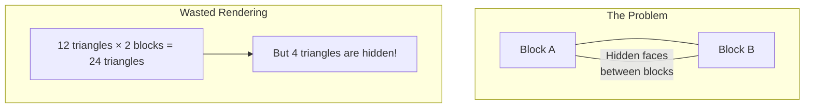
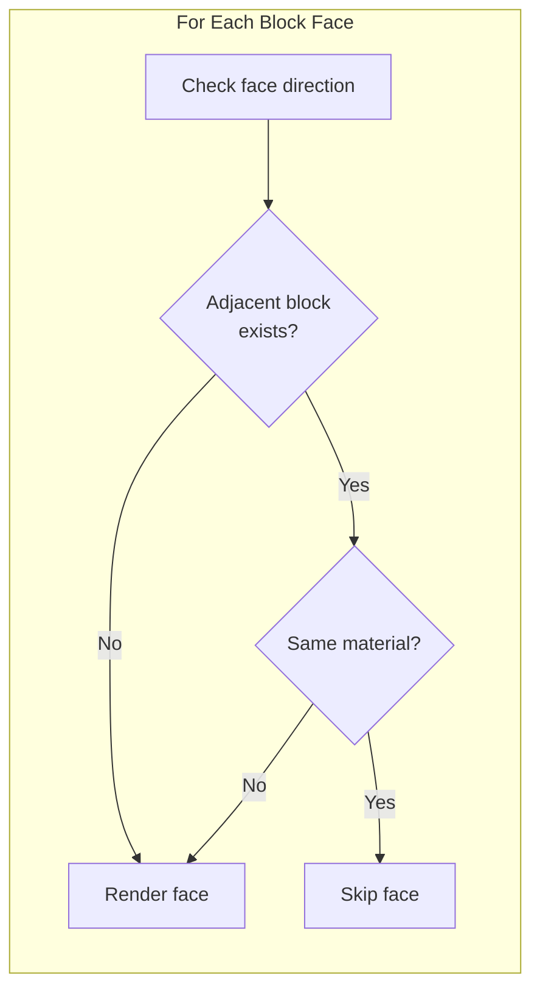
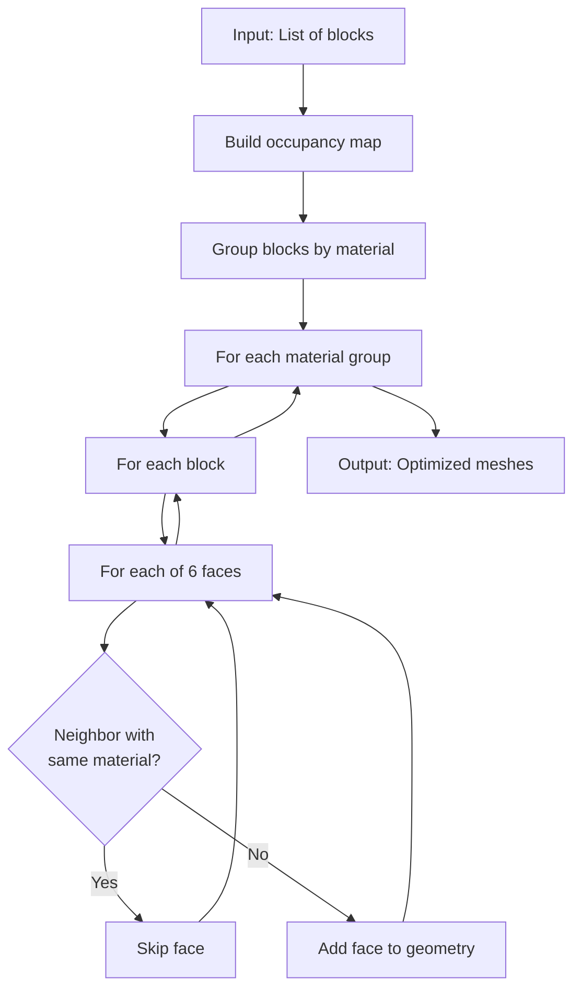
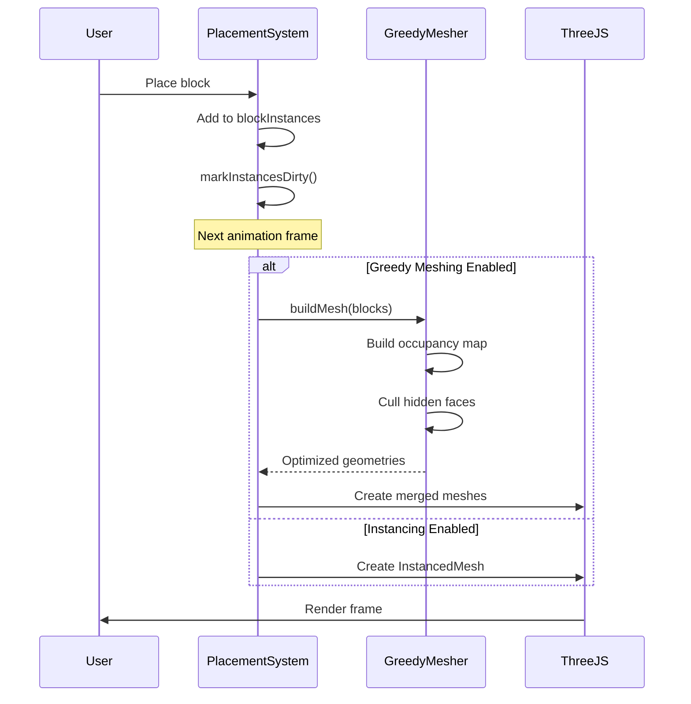

# Greedy Meshing: Optimizing Voxel Rendering

This guide explains the Greedy Meshing algorithm - a powerful technique for optimizing voxel-based games like Minecraft. We'll cover the core concepts, walk through our implementation, and show how it dramatically reduces polygon count.

## Table of Contents

1. [The Problem: Too Many Polygons](#the-problem-too-many-polygons)
2. [The Solution: Hidden Face Culling](#the-solution-hidden-face-culling)
3. [How Greedy Meshing Works](#how-greedy-meshing-works)
4. [Our Implementation](#our-implementation)
5. [Integration with PlacementSystem](#integration-with-placementsystem)
6. [Performance Results](#performance-results)
7. [Using the Performance Panel](#using-the-performance-panel)

---

## The Problem: Too Many Polygons

In a voxel game, every block is typically rendered as a cube with 6 faces. Each face has 2 triangles, so one block = 12 triangles.

```
Single Block = 6 faces × 2 triangles = 12 triangles
```

This seems fine for a few blocks, but it quickly becomes a problem:

| Blocks | Triangles (Naive) |
|--------|-------------------|
| 100    | 1,200             |
| 1,000  | 12,000            |
| 10,000 | 120,000           |
| 100,000| 1,200,000         |

Even worse, when blocks are placed next to each other, many of these triangles are **completely hidden** - they're inside the structure and will never be seen!



### Visual Example: A Simple Wall

Consider a 3×3 wall of blocks:

```
┌───┬───┬───┐
│ A │ B │ C │
├───┼───┼───┤
│ D │ E │ F │
├───┼───┼───┤
│ G │ H │ I │
└───┴───┴───┘
```

**Naive rendering:** 9 blocks × 12 triangles = **108 triangles**

But look at block E in the center - it's surrounded on 4 sides! Those 4 faces (8 triangles) will never be seen. The same applies to edges of other blocks.

---

## The Solution: Hidden Face Culling

The key insight is simple: **don't render faces that can't be seen**.

A face is hidden when there's an adjacent block with the same material covering it. We only need to render faces that are:
- On the exterior of the structure
- Between blocks of different materials (if we want to see the boundary)



### The Six Face Directions

Every cube has 6 faces, each facing a cardinal direction:

```
        +Y (Top)
           │
           │
    -X ────┼──── +X
   (Left)  │    (Right)
           │
        -Y (Bottom)

        +Z (Front) / -Z (Back)
```

For each face, we check if there's a neighboring block:

| Face   | Direction | Neighbor Offset |
|--------|-----------|-----------------|
| Right  | +X        | (x+1, y, z)     |
| Left   | -X        | (x-1, y, z)     |
| Top    | +Y        | (x, y+1, z)     |
| Bottom | -Y        | (x, y-1, z)     |
| Front  | +Z        | (x, y, z+1)     |
| Back   | -Z        | (x, y, z-1)     |

---

## How Greedy Meshing Works

Our implementation follows these steps:



### Step 1: Build Occupancy Map

First, we create a fast lookup structure to check if a block exists at any position:

```typescript
// Map of "x,y,z" -> materialKey
private occupiedBlocks: Map<string, string> = new Map();

// Build the map
for (const block of blocks) {
  const key = `${block.x},${block.y},${block.z}`;
  this.occupiedBlocks.set(key, block.materialKey);
}
```

### Step 2: Check Each Face

For each block, we check all 6 faces against their neighbors:

```typescript
// Face directions with their vertex corners
const FACE_DIRECTIONS = [
  { dir: [1, 0, 0], corners: [...] },   // +X (right)
  { dir: [-1, 0, 0], corners: [...] },  // -X (left)
  { dir: [0, 1, 0], corners: [...] },   // +Y (top)
  { dir: [0, -1, 0], corners: [...] },  // -Y (bottom)
  { dir: [0, 0, 1], corners: [...] },   // +Z (front)
  { dir: [0, 0, -1], corners: [...] },  // -Z (back)
];
```

### Step 3: Generate Optimized Geometry

Only visible faces are added to the final geometry:

```typescript
for (const block of blocks) {
  for (let faceIdx = 0; faceIdx < 6; faceIdx++) {
    const face = FACE_DIRECTIONS[faceIdx];

    // Calculate neighbor position
    const neighborX = block.x + face.dir[0];
    const neighborY = block.y + face.dir[1];
    const neighborZ = block.z + face.dir[2];

    // Skip if neighbor has same material (face is hidden)
    if (this.hasSameMaterial(neighborX, neighborY, neighborZ, block.materialKey)) {
      continue;  // Don't render this face!
    }

    // Add visible face to geometry
    this.addFaceToGeometry(block, face);
  }
}
```

---

## Our Implementation

The complete implementation lives in `src/systems/GreedyMesher.ts`. Let's walk through the key parts:

### The GreedyMesher Class

```typescript
export class GreedyMesher {
  private blockSize: number;
  private occupiedBlocks: Map<string, string>; // "x,y,z" -> materialKey

  constructor(blockSize: number = 1) {
    this.blockSize = blockSize;
    this.occupiedBlocks = new Map();
  }
```

The class maintains:
- `blockSize`: The size of each block in world units
- `occupiedBlocks`: A map for O(1) neighbor lookups

### Building the Mesh

The main entry point is `buildMesh()`:

```typescript
buildMesh(blocks: BlockData[]): MeshedGeometry[] {
  // Step 1: Build occupancy map for fast neighbor lookups
  this.occupiedBlocks.clear();
  for (const block of blocks) {
    this.occupiedBlocks.set(
      this.blockKey(block.x, block.y, block.z),
      block.materialKey
    );
  }

  // Step 2: Group blocks by material (for batching)
  const blocksByMaterial = new Map<string, BlockData[]>();
  for (const block of blocks) {
    const group = blocksByMaterial.get(block.materialKey) || [];
    group.push(block);
    blocksByMaterial.set(block.materialKey, group);
  }

  // Step 3: Generate optimized geometry per material
  const results: MeshedGeometry[] = [];
  for (const [materialKey, materialBlocks] of blocksByMaterial) {
    const geometry = this.buildGeometryForMaterial(materialBlocks);
    if (geometry) {
      results.push({ geometry, materialKey, faceCount: ... });
    }
  }

  return results;
}
```

### The Core Algorithm: Building Geometry

```typescript
private buildGeometryForMaterial(blocks: BlockData[]): THREE.BufferGeometry | null {
  const positions: number[] = [];
  const normals: number[] = [];
  const indices: number[] = [];
  let vertexOffset = 0;

  for (const block of blocks) {
    // Check each of the 6 faces
    for (let faceIdx = 0; faceIdx < 6; faceIdx++) {
      const face = FACE_DIRECTIONS[faceIdx];
      const normal = FACE_NORMALS[faceIdx];

      // Calculate neighbor position
      const neighborX = block.x + face.dir[0];
      const neighborY = block.y + face.dir[1];
      const neighborZ = block.z + face.dir[2];

      // KEY OPTIMIZATION: Skip hidden faces!
      if (this.hasSameMaterial(neighborX, neighborY, neighborZ, block.materialKey)) {
        continue;
      }

      // Add the 4 corners of this face
      for (const corner of face.corners) {
        positions.push(
          (block.x + corner[0]) * this.blockSize,
          (block.y + corner[1]) * this.blockSize,
          (block.z + corner[2]) * this.blockSize
        );
        normals.push(normal[0], normal[1], normal[2]);
      }

      // Add indices for 2 triangles (quad)
      indices.push(
        vertexOffset, vertexOffset + 1, vertexOffset + 2,
        vertexOffset, vertexOffset + 2, vertexOffset + 3
      );
      vertexOffset += 4;
    }
  }

  // Create Three.js geometry
  const geometry = new THREE.BufferGeometry();
  geometry.setAttribute("position", new THREE.Float32BufferAttribute(positions, 3));
  geometry.setAttribute("normal", new THREE.Float32BufferAttribute(normals, 3));
  geometry.setIndex(indices);

  return geometry;
}
```

### Face Direction Data

Each face needs to know its direction and corner positions:

```typescript
const FACE_DIRECTIONS = [
  // +X (right face)
  {
    dir: [1, 0, 0],
    corners: [[1,0,0], [1,1,0], [1,1,1], [1,0,1]]
  },
  // -X (left face)
  {
    dir: [-1, 0, 0],
    corners: [[0,0,1], [0,1,1], [0,1,0], [0,0,0]]
  },
  // +Y (top face)
  {
    dir: [0, 1, 0],
    corners: [[0,1,1], [1,1,1], [1,1,0], [0,1,0]]
  },
  // -Y (bottom face)
  {
    dir: [0, -1, 0],
    corners: [[0,0,0], [1,0,0], [1,0,1], [0,0,1]]
  },
  // +Z (front face)
  {
    dir: [0, 0, 1],
    corners: [[0,0,1], [1,0,1], [1,1,1], [0,1,1]]
  },
  // -Z (back face)
  {
    dir: [0, 0, -1],
    corners: [[1,0,0], [0,0,0], [0,1,0], [1,1,0]]
  },
];
```

The corners are ordered to create proper winding for face culling (counter-clockwise when viewed from outside).

---

## Integration with PlacementSystem

The greedy mesher is integrated into `PlacementSystem.ts` as an alternative rendering mode.

### Enabling Greedy Meshing

```typescript
// In PlacementSystem constructor
constructor(scene: THREE.Scene, config: PlacementConfig) {
  this.useGreedyMeshing = config.useGreedyMeshing ?? false;
  this.greedyMesher = new GreedyMesher(config.cellSize);
  // ...
}

// Toggle at runtime
setGreedyMeshing(enabled: boolean): void {
  if (this.useGreedyMeshing === enabled) return;

  this.useGreedyMeshing = enabled;

  if (enabled) {
    // Switch from instancing to greedy meshing
    this.instancedMeshGroup.visible = false;
    this.scene.add(this.greedyMeshGroup);
    this.rebuildGreedyMeshesNow();
  } else {
    // Switch back to instancing
    this.scene.remove(this.greedyMeshGroup);
    this.instancedMeshGroup.visible = true;
    this.rebuildInstancedMeshesNow();
  }
}
```

### Rebuilding Meshes

When blocks change, we rebuild the optimized geometry:

```typescript
private rebuildGreedyMeshes(): void {
  // Clear existing meshes
  this.clearGreedyMeshes();

  // Get blocks in mesher format
  const blocks = this.getBlocksForMesher();
  if (blocks.length === 0) return;

  // Build optimized geometry
  const meshedGeometries = this.greedyMesher.buildMesh(blocks);

  // Create Three.js meshes
  for (const { geometry, materialKey } of meshedGeometries) {
    const material = this.materialCache.get(materialKey);
    if (!material) continue;

    const mesh = new THREE.Mesh(geometry, material);
    mesh.frustumCulled = true;

    this.greedyMeshes.set(materialKey, mesh);
    this.greedyMeshGroup.add(mesh);
  }
}
```

### Data Flow Diagram



---

## Performance Results

The effectiveness of greedy meshing depends on how "solid" your structures are:

### Best Case: Solid Cube

A 10×10×10 solid cube:
- **Naive:** 1,000 blocks × 12 triangles = **12,000 triangles**
- **Greedy:** Only exterior faces = **1,200 triangles** (90% reduction!)

### Typical Case: Building with Rooms

A building with walls and rooms:
- Interior walls have many hidden faces
- Typical reduction: **50-70%**

### Worst Case: Scattered Blocks

Individual blocks with no neighbors:
- No faces can be culled
- Same triangle count as naive rendering
- But still benefits from material batching

### Statistics Function

You can check the effectiveness at runtime:

```typescript
getGreedyMeshingStats(): {
  enabled: boolean;
  totalBlocks: number;
  meshCount: number;
  culledFaces: number;
  cullPercentage: number;
  estimatedTriangles: number;
}
```

---

## Using the Performance Panel

Press **Shift+P** to open the Performance Panel and see real-time stats:

```
┌─────────────────────────┐
│ Performance             │
├─────────────────────────┤
│ FPS:          60        │
│ Blocks:       1,234     │
│ Draw Calls:   5         │
│ Triangles:    8,432     │
│ Render Mode:  greedy    │
│ Faces Culled: 12,456    │
│ Cull %:       59.4%     │
├─────────────────────────┤
│ Greedy Mesh:  [ON]      │
└─────────────────────────┘
```

### What the Stats Mean

| Stat | Description |
|------|-------------|
| FPS | Frames per second (higher is better) |
| Blocks | Total number of placed blocks |
| Draw Calls | Number of render calls (lower is better) |
| Triangles | Total triangles being rendered |
| Render Mode | Current mode: `greedy`, `instancing`, or `individual` |
| Faces Culled | Number of hidden faces not rendered |
| Cull % | Percentage of faces saved |

### Toggle Button

Click the **Greedy Mesh: ON/OFF** button to switch between:
- **OFF (Instancing):** Each block rendered via GPU instancing
- **ON (Greedy):** Hidden faces culled, geometry merged

---

## Summary

Greedy meshing is a powerful optimization for voxel games:

1. **Problem:** Naive rendering wastes triangles on hidden faces
2. **Solution:** Check neighbors and skip hidden faces
3. **Implementation:**
   - Build occupancy map for fast lookups
   - Check 6 directions for each block
   - Only render faces with no same-material neighbor
4. **Results:** 50-90% triangle reduction for dense structures

The trade-off is CPU cost when blocks change (must rebuild geometry), but for most games this is a worthwhile exchange for dramatically better rendering performance.

### Key Files

- `src/systems/GreedyMesher.ts` - The meshing algorithm
- `src/structures/PlacementSystem.ts` - Integration with block system
- `src/ui/PerformancePanel.ts` - Real-time stats display

### Further Reading

- [Meshing in a Minecraft Game](https://0fps.net/2012/06/30/meshing-in-a-minecraft-game/) - Original greedy meshing article
- [Three.js BufferGeometry](https://threejs.org/docs/#api/en/core/BufferGeometry) - How we build geometry
- [GPU Instancing](https://threejs.org/docs/#api/en/objects/InstancedMesh) - Alternative optimization
