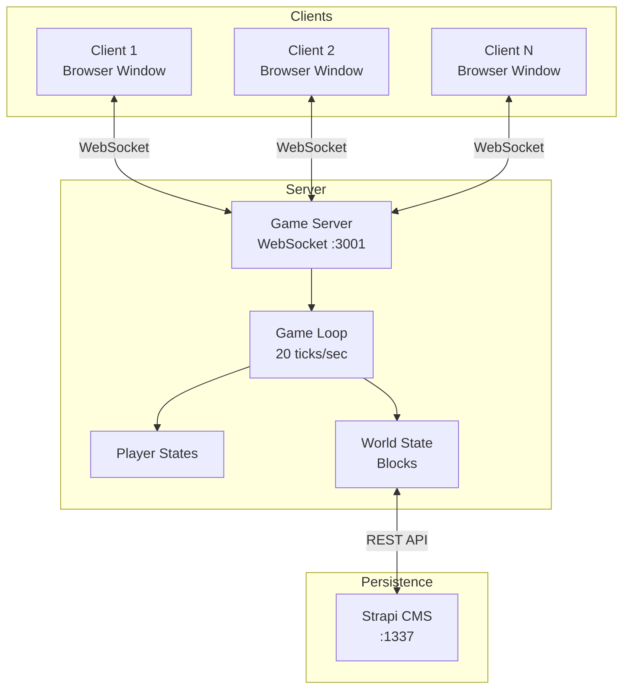
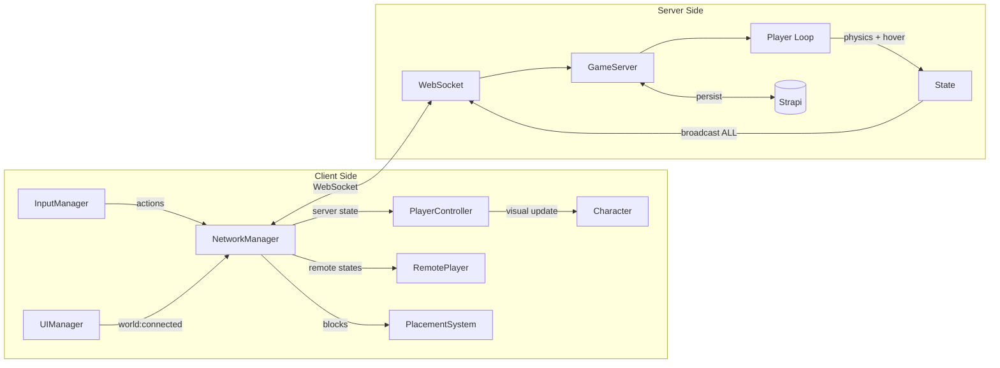
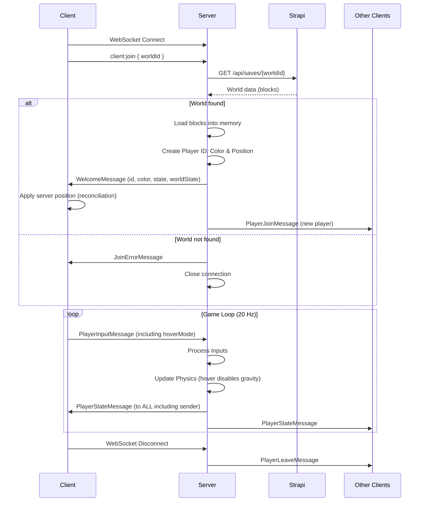
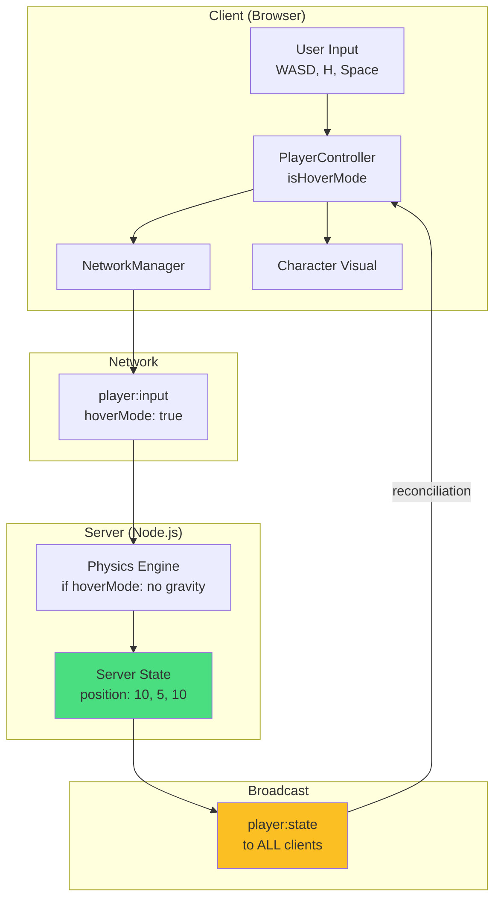
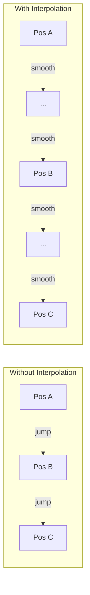
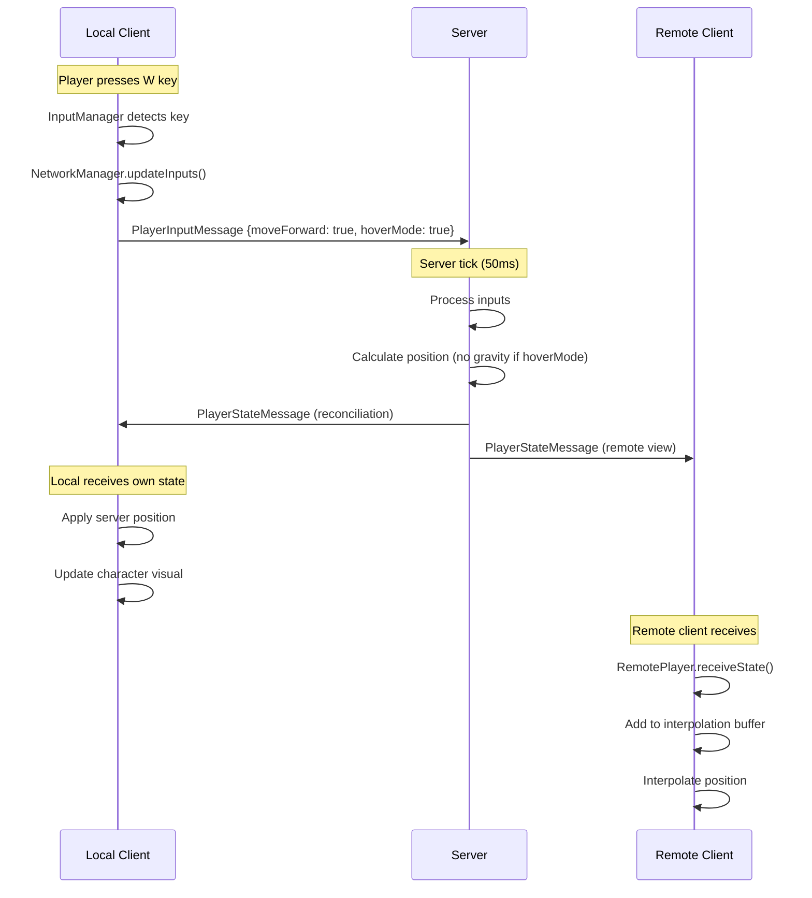
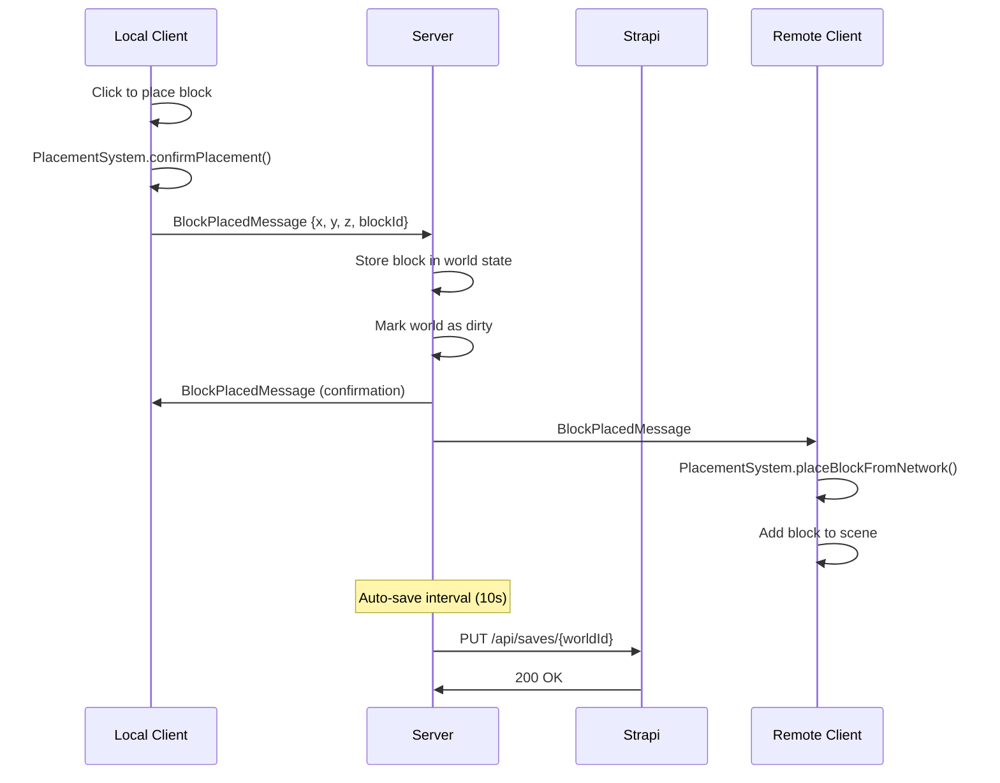
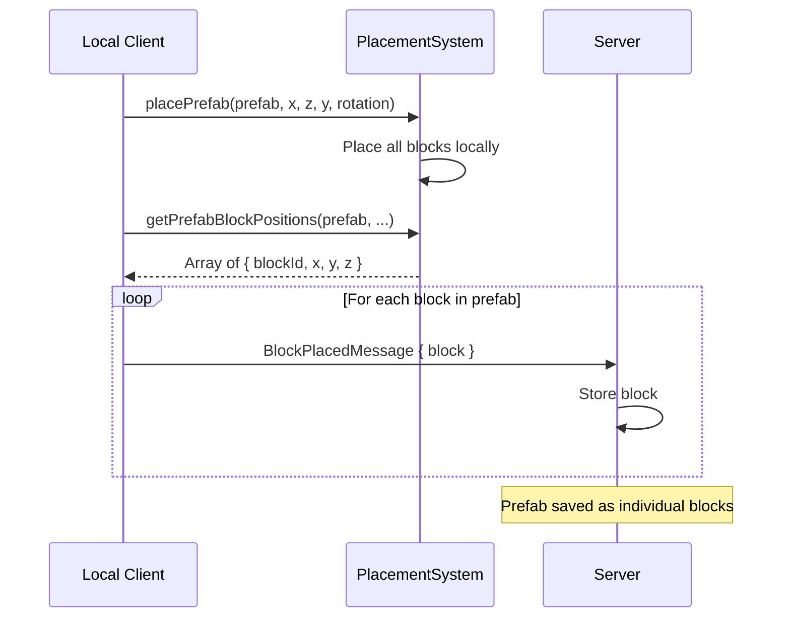

# Multiplayer Architecture Documentation

This document explains the multiplayer implementation for the Grid Builder game, covering the architecture, networking concepts, and code implementation details.

## Table of Contents

1. [Overview](#overview)
2. [Architecture](#architecture)
3. [Network Protocol](#network-protocol)
4. [Server Implementation](#server-implementation)
5. [Client Implementation](#client-implementation)
6. [Server Reconciliation](#server-reconciliation)
7. [Interpolation & Lag Compensation](#interpolation--lag-compensation)
8. [Data Flow](#data-flow)
9. [World Persistence with Strapi](#world-persistence-with-strapi)
10. [Key Concepts](#key-concepts)
11. [Troubleshooting & Issues Resolved](#troubleshooting--issues-resolved)

---

## Overview

The multiplayer system uses a **client-server architecture** with **fully server-authoritative movement**. This means:

- The server is the single source of truth for ALL game state
- Clients send inputs to the server (not positions)
- Server calculates positions and broadcasts to ALL clients (including sender)
- Local player applies server state for reconciliation (prevents drift)
- Remote clients interpolate player positions for smooth movement
- World state is persisted to Strapi CMS



---

## Architecture

### File Structure

```
src/
├── network/
│   ├── NetworkProtocol.ts    # Shared message types & interfaces
│   └── NetworkManager.ts     # Client-side WebSocket handler
├── entities/
│   ├── Character.ts          # Local player visual
│   └── RemotePlayer.ts       # Remote player visual + interpolation
├── core/
│   ├── PlayerState.ts        # Serializable player state
│   ├── PlayerController.ts   # Local player movement (used for input collection)
│   └── SaveSystem.ts         # World ID management & Strapi validation
├── ui/
│   └── UIManager.ts          # World connection modal & status display
└── main.ts                   # Game integration & networking orchestration

server/
└── GameServer.ts             # WebSocket game server with Strapi integration
```

### Component Responsibilities



---

## Network Protocol

All messages are JSON-serializable TypeScript interfaces with a `type` discriminator for routing.

### Client → Server Messages

```typescript
// src/network/NetworkProtocol.ts

// Client specifies which world to join (first message after connect)
interface ClientJoinMessage {
  type: "client:join";
  worldId: string;  // Strapi document ID
}

// Player inputs sent at 20 Hz
interface PlayerInputMessage {
  type: "player:input";
  playerId: string;
  inputs: PlayerInputs;
  timestamp: number;
}

// Block operations
interface BlockPlacedMessage {
  type: "block:placed";
  playerId: string;
  block: NetworkBlock;
}

interface BlockRemovedMessage {
  type: "block:removed";
  playerId: string;
  position: Vector3;
}

// World operations
interface WorldSaveRequestMessage {
  type: "world:save";
  playerId: string;
}

interface WorldResetMessage {
  type: "world:reset";
  playerId: string;
}

// Latency measurement
interface PingMessage {
  type: "ping";
  timestamp: number;
}
```

### Server → Client Messages

```typescript
// Welcome message with player's initial state
interface WelcomeMessage {
  type: "welcome";
  playerId: string;
  color: string;
  state: PlayerState;      // Server-assigned initial position
  worldState: WorldStateMessage;
}

// Join error (world not found)
interface JoinErrorMessage {
  type: "join:error";
  message: string;
}

// Player events
interface PlayerJoinMessage {
  type: "player:join";
  playerId: string;
  state: PlayerState;
  color: string;
}

interface PlayerLeaveMessage {
  type: "player:leave";
  playerId: string;
}

// Player state (sent to ALL clients including owner for reconciliation)
interface PlayerStateMessage {
  type: "player:state";
  playerId: string;
  state: PlayerState;
  timestamp: number;
}

// Save response
interface WorldSaveResponseMessage {
  type: "world:saved";
  success: boolean;
  message?: string;
}

// Latency response
interface PongMessage {
  type: "pong";
  timestamp: number;
  serverTime: number;
}
```

### Player State

The `PlayerState` interface is designed to be minimal and serializable:

```typescript
// src/core/PlayerState.ts

interface PlayerState {
  position: { x: number; y: number; z: number };
  rotation: number;      // Y-axis rotation in radians
  velocity: { x: number; y: number; z: number };
  isMoving: boolean;
  isGrounded: boolean;
}
```

### Input State

Clients send their current input state (including hover mode):

```typescript
interface PlayerInputs {
  moveForward: boolean;
  moveBackward: boolean;
  moveLeft: boolean;
  moveRight: boolean;
  jetpackUp: boolean;
  jetpackDown: boolean;
  sprint: boolean;
  hoverMode: boolean;    // Disables gravity when true
  cameraYaw: number;     // Camera direction for movement calculation
}
```

---

## Server Implementation

### Game Server Overview

The server runs a fixed-timestep game loop at 20 ticks per second (50ms intervals).

```typescript
// server/GameServer.ts

const TICK_RATE = 20;
const TICK_INTERVAL = 1000 / TICK_RATE; // 50ms

class GameServer {
  private wss: WebSocketServer;
  private players: Map<string, ConnectedPlayer> = new Map();
  private blocks: Map<string, NetworkBlock> = new Map();
  private strapiDocumentId: string | null = null;

  constructor() {
    this.wss = new WebSocketServer({ port: 3001 });
    this.initialize();
  }

  private async initialize(): Promise<void> {
    this.setupServer();
    this.startGameLoop();
    this.startAutoSave();
    console.log("Waiting for client to specify world ID...");
  }

  private startGameLoop(): void {
    setInterval(() => {
      const deltaTime = TICK_INTERVAL / 1000;
      this.updatePlayers(deltaTime);
      this.broadcastPlayerStates();
    }, TICK_INTERVAL);
  }
}
```

### Connection Flow (Client-Driven World Selection)



### Server-Side Physics (With Hover Mode)

The server processes player inputs and calculates movement, including hover mode:

```typescript
private updatePlayers(deltaTime: number): void {
  for (const player of this.players.values()) {
    if (!player.inputs) continue;

    const state = player.state;
    const inputs = player.inputs;

    // Calculate movement direction from inputs
    let moveX = 0, moveZ = 0;
    if (inputs.moveForward) moveZ -= 1;
    if (inputs.moveBackward) moveZ += 1;
    if (inputs.moveLeft) moveX -= 1;
    if (inputs.moveRight) moveX += 1;

    // Normalize diagonal movement
    const length = Math.sqrt(moveX * moveX + moveZ * moveZ);
    if (length > 0) {
      moveX /= length;
      moveZ /= length;
    }

    // Transform to world space using camera yaw
    const yaw = inputs.cameraYaw;
    const forwardX = -Math.sin(yaw);
    const forwardZ = -Math.cos(yaw);
    const rightX = Math.cos(yaw);
    const rightZ = -Math.sin(yaw);

    const worldMoveX = forwardX * -moveZ + rightX * moveX;
    const worldMoveZ = forwardZ * -moveZ + rightZ * moveX;

    // Apply velocity
    const speed = inputs.sprint ? this.moveSpeed * 2 : this.moveSpeed;
    state.velocity.x = worldMoveX * speed;
    state.velocity.z = worldMoveZ * speed;
    state.isMoving = length > 0;

    // Update rotation to face movement direction
    if (state.isMoving) {
      state.rotation = Math.atan2(state.velocity.x, state.velocity.z);
    }

    // Vertical movement - HOVER MODE disables gravity
    if (inputs.hoverMode) {
      // Hover: no gravity, use jetpack for vertical movement
      if (inputs.jetpackUp) {
        state.velocity.y = this.jumpForce;
      } else if (inputs.jetpackDown) {
        state.velocity.y = -this.jumpForce;
      } else {
        state.velocity.y = 0; // Hover in place
      }
      state.isGrounded = false;
    } else {
      // Normal: apply gravity
      if (inputs.jetpackUp) {
        state.velocity.y = this.jumpForce;
        state.isGrounded = false;
      } else if (inputs.jetpackDown) {
        state.velocity.y = -this.jumpForce;
        state.isGrounded = false;
      } else if (!state.isGrounded) {
        state.velocity.y -= this.gravity * deltaTime;
      } else {
        state.velocity.y = 0;
      }
    }

    // Apply movement with collision detection
    this.applyMovementWithCollision(state, newX, newY, newZ);
  }
}
```

### Broadcasting to ALL Clients (Including Sender)

The server sends state updates to ALL players, including the player who owns that state. This enables server reconciliation:

```typescript
private broadcastPlayerStates(): void {
  const now = Date.now();

  for (const player of this.players.values()) {
    const stateMsg: PlayerStateMessage = {
      type: "player:state",
      playerId: player.playerId,
      state: player.state,
      timestamp: now,
    };

    // Send to ALL players (including owner for reconciliation)
    this.broadcast(stateMsg);  // No exclude parameter
  }
}
```

---

## Client Implementation

### NetworkManager

The client-side NetworkManager handles WebSocket communication:

```typescript
// src/network/NetworkManager.ts

export interface NetworkManagerConfig {
  serverUrl: string;
  worldId?: string;  // Strapi document ID for world to join
  onConnected?: (playerId: string, color: string, state: PlayerState) => void;
  onDisconnected?: () => void;
  onJoinError?: (message: string) => void;
  onPlayerJoined?: (player: NetworkPlayer) => void;
  onPlayerLeft?: (playerId: string) => void;
  onPlayerStateUpdate?: (playerId: string, state: PlayerState, timestamp: number) => void;
  onBlockPlaced?: (playerId: string, block: NetworkBlock) => void;
  onBlockRemoved?: (playerId: string, x: number, y: number, z: number) => void;
  onWorldState?: (blocks: NetworkBlock[], players: NetworkPlayer[]) => void;
  onWorldSaved?: (success: boolean, message?: string) => void;
}

export class NetworkManager {
  private ws: WebSocket | null = null;
  private currentInputs: PlayerInputs = createPlayerInputs();
  private readonly INPUT_SEND_RATE = 50; // 20 Hz

  connect(): void {
    this.ws = new WebSocket(this.config.serverUrl);

    this.ws.onopen = () => {
      // Send world ID to join specific world
      if (this.config.worldId) {
        this.send({ type: "client:join", worldId: this.config.worldId });
      }
      this.startInputSending();
      this.startPinging();
    };

    this.ws.onmessage = (event) => {
      const message = JSON.parse(event.data);
      this.handleMessage(message);
    };
  }

  private handleMessage(message: ServerMessage): void {
    switch (message.type) {
      case "player:state":
        // Process ALL state updates (including our own for reconciliation)
        this.config.onPlayerStateUpdate?.(
          message.playerId,
          message.state,
          message.timestamp
        );
        break;
      // ... other handlers
    }
  }
}
```

### Sending Inputs (Including Hover Mode)

```typescript
// src/main.ts

private sendInputsToServer(): void {
  if (!this.networkManager || !this.isMultiplayer) return;

  this.networkManager.updateInputs({
    moveForward: this.inputManager.isActionActive("moveForward"),
    moveBackward: this.inputManager.isActionActive("moveBackward"),
    moveLeft: this.inputManager.isActionActive("moveLeft"),
    moveRight: this.inputManager.isActionActive("moveRight"),
    jetpackUp: this.inputManager.isActionActive("jetpackUp"),
    jetpackDown: this.inputManager.isActionActive("jetpackDown"),
    sprint: this.inputManager.isKeyPressed("shift"),
    hoverMode: this.playerController.isHoverMode(),  // Synced to server!
  });

  this.networkManager.setCameraYaw(this.cameraSystem.getYaw());
}
```

---

## Server Reconciliation

### The Problem: Client-Server Drift

If the local player uses local physics while the server also calculates physics, they can drift apart:

```
Frame 1: Client at (10, 5, 10), Server at (10, 5, 10) ✓
Frame 100: Client at (15.1, 5.2, 12.3), Server at (15.0, 5.0, 12.5) ✗
Frame 500: Client at (25.5, 6.8, 18.2), Server at (24.8, 5.0, 17.9) ✗✗
```

Remote clients would see the player at the SERVER position, causing visual desync.

### The Solution: Apply Server State to Local Player

The client receives its own state from the server and applies it:

```typescript
// src/main.ts

onPlayerStateUpdate: (playerId: string, state: PlayerState, timestamp: number) => {
  // Check if this is our own state (server reconciliation)
  if (playerId === this.localPlayerId) {
    // Apply server-authoritative position to prevent drift
    this.playerController.setPosition(
      state.position.x,
      state.position.y,
      state.position.z
    );
    this.playerController.setRotation(state.rotation);

    // Update character visual
    const pos = this.playerController.getPosition();
    this.character.setPositionFromVector(pos);
    this.character.setRotation(state.rotation);

    // Update camera to follow
    this.cameraSystem.setPlayerPosition(pos);
    return;
  }

  // Remote player - add to interpolation buffer
  const remotePlayer = this.remotePlayers.get(playerId);
  if (remotePlayer) {
    remotePlayer.receiveState(state, timestamp);
  }
}
```

### State Flow Diagram



---

## Interpolation & Lag Compensation

### The Problem

Network updates arrive at irregular intervals (typically 50ms apart at 20 tick/sec). Without interpolation, remote players would "teleport" between positions, creating jerky movement.



### Interpolation Buffer

Remote players maintain a buffer of recent state snapshots:

```typescript
// src/entities/RemotePlayer.ts

interface StateSnapshot {
  state: PlayerState;
  timestamp: number;
}

export class RemotePlayer {
  private stateBuffer: StateSnapshot[] = [];
  private readonly MAX_BUFFER_SIZE = 10;
  private readonly interpolationTime = 100; // 100ms buffer

  receiveState(state: PlayerState, timestamp: number): void {
    this.stateBuffer.push({ state, timestamp });
    this.stateBuffer.sort((a, b) => a.timestamp - b.timestamp);
    while (this.stateBuffer.length > this.MAX_BUFFER_SIZE) {
      this.stateBuffer.shift();
    }
  }
}
```

### Interpolation Algorithm

```typescript
update(_deltaTime: number): void {
  if (this.stateBuffer.length < 2) return;

  // Render 100ms behind current time
  const renderTime = Date.now() - this.interpolationTime;

  // Find two states that bracket renderTime
  let fromState: StateSnapshot | null = null;
  let toState: StateSnapshot | null = null;

  for (let i = 0; i < this.stateBuffer.length - 1; i++) {
    if (this.stateBuffer[i].timestamp <= renderTime &&
        this.stateBuffer[i + 1].timestamp >= renderTime) {
      fromState = this.stateBuffer[i];
      toState = this.stateBuffer[i + 1];
      break;
    }
  }

  if (fromState && toState) {
    const duration = toState.timestamp - fromState.timestamp;
    const elapsed = renderTime - fromState.timestamp;
    const t = Math.max(0, Math.min(1, elapsed / duration));

    // Lerp position
    this.currentPosition.x = this.lerp(fromState.state.position.x, toState.state.position.x, t);
    this.currentPosition.y = this.lerp(fromState.state.position.y, toState.state.position.y, t);
    this.currentPosition.z = this.lerp(fromState.state.position.z, toState.state.position.z, t);

    // Lerp rotation (handle angle wrap-around)
    this.currentRotation = this.lerpAngle(fromState.state.rotation, toState.state.rotation, t);
  }
}
```

---

## Data Flow

### Complete Message Flow



### Block Placement Flow



### Prefab Placement Flow

Prefabs are decomposed into individual blocks:



---

## World Persistence with Strapi

### Overview

The server uses Strapi CMS as the persistent storage. The client specifies which world to join via the Strapi document ID.

### Client-Driven World Selection

```typescript
// UIManager - Join World Modal
private async connectToWorld(): Promise<void> {
  const worldId = this.worldIdInput.value.trim();

  // Validate world exists in Strapi
  const worldInfo = await validateWorldId();
  if (!worldInfo) {
    this.showError("World not found");
    return;
  }

  // Save to localStorage for auto-reconnect
  setWorldId(worldId);

  // Emit event to trigger networking
  emitEvent("world:connected", { worldId });
}
```

### Server World Loading

```typescript
private async loadWorldById(worldId: string): Promise<boolean> {
  try {
    const response = await fetch(`${STRAPI_SAVE_ENDPOINT}/${worldId}`);
    if (!response.ok) return false;

    const result = await response.json();
    const saveData = result.data.data;

    this.blocks.clear();
    this.strapiDocumentId = worldId;

    if (saveData.blocks && Array.isArray(saveData.blocks)) {
      for (const block of saveData.blocks) {
        const key = `${block.x},${block.y},${block.z}`;
        this.blocks.set(key, {
          x: block.x,
          y: block.y,
          z: block.z,
          structureId: block.blockId,
          rotation: 0,
        });
      }
    }

    console.log(`Loaded world ${worldId}: ${this.blocks.size} blocks`);
    return true;
  } catch (e) {
    console.error(`Failed to load world:`, e);
    return false;
  }
}
```

### Auto-Save to Strapi

```typescript
private startAutoSave(): void {
  setInterval(() => {
    this.saveWorldToStrapi();
  }, SAVE_INTERVAL); // 10 seconds

  process.on("SIGINT", async () => {
    console.log("\nShutting down...");
    this.worldDirty = true;
    await this.saveWorldToStrapi();
    process.exit(0);
  });
}

private async saveToStrapi(): Promise<boolean> {
  if (!this.strapiDocumentId) return false;

  const saveData = {
    version: 1,
    timestamp: new Date().toISOString(),
    blocks: Array.from(this.blocks.values()).map(b => ({
      blockId: b.structureId,
      x: b.x,
      y: b.y,
      z: b.z,
    })),
  };

  const response = await fetch(`${STRAPI_SAVE_ENDPOINT}/${this.strapiDocumentId}`, {
    method: "PUT",
    headers: { "Content-Type": "application/json" },
    body: JSON.stringify({ data: { data: saveData } }),
  });

  if (response.ok) this.worldDirty = false;
  return response.ok;
}
```

---

## Key Concepts

### 1. Fully Server-Authoritative Movement

**Why?** Prevents cheating, ensures consistency, and eliminates drift.

```
Client: "I'm pressing W and H (hover)"  →  Server
Server: Calculates position with no gravity
Server: "You are now at (10, 5, 5)"  →  ALL Clients (including sender)
Client: Applies server position to local player
```

### 2. Client-Driven World Selection

The client specifies which world to load via the Strapi document ID:

```typescript
// Client sends after WebSocket connect
{ type: "client:join", worldId: "abc123xyz" }

// Server loads from Strapi or returns error
{ type: "join:error", message: "World not found" }
```

### 3. Hover Mode Synchronization

Hover mode affects physics (disables gravity). It MUST be synced to server:

```typescript
// Client sends hover state with every input
inputs: {
  hoverMode: this.playerController.isHoverMode(),
  // ...
}

// Server applies hover logic
if (inputs.hoverMode) {
  state.velocity.y = 0; // No gravity
}
```

Without this, the server would apply gravity and other clients would see the player falling.

### 4. Server Reconciliation

The server sends state back to the local player, not just remotes:

```typescript
// Server broadcasts to ALL (no exclude)
this.broadcast(stateMsg);

// Client applies own state
if (playerId === this.localPlayerId) {
  this.playerController.setPosition(state.position);
}
```

### 5. Fixed Timestep Server

The server runs at exactly 20 ticks/second:

```typescript
setInterval(() => {
  updatePlayers(0.05); // Always 50ms delta
  broadcastStates();
}, 50);
```

---

## Troubleshooting & Issues Resolved

### Issue 1: Players at Different Positions

**Symptom**: In one browser, players appeared together. In another, they appeared far apart.

**Cause**: Each client had different local positions - server state wasn't being applied.

**Solution**: Server sends state to ALL clients, and clients apply their own state (reconciliation).

### Issue 2: Hover Mode Not Syncing

**Symptom**: Player hovers on their screen but falls on other clients' screens.

**Cause**: `hoverMode` wasn't included in `PlayerInputs` sent to server.

**Solution**: Added `hoverMode: boolean` to PlayerInputs interface and send it with every input update.

### Issue 3: World Not Saving

**Symptom**: Blocks placed online weren't persisting.

**Cause**: Server was checking Strapi availability with a HEAD request that returned 403.

**Solution**: Removed availability check - rely on `strapiDocumentId` being set after successful world load.

### Issue 4: Prefabs Not Saving

**Symptom**: Individual blocks saved, but prefabs didn't.

**Cause**: Prefabs were placed locally but individual blocks weren't sent to server.

**Solution**: Added `getPrefabBlockPositions()` and loop to send each block to server.

### Debugging Tips

1. **Check WebSocket in DevTools**: Network → WS tab shows all messages
2. **Verify world ID**: Console shows "Loaded world {id}: X blocks"
3. **Check hover mode**: Server should log physics with hover flag
4. **Verify reconciliation**: Local player should snap to server position

---

## Running the Multiplayer System

```bash
# Install dependencies
npm install

# Start Strapi (separate terminal)
cd strapi && npm run develop

# Start both servers
npm run dev:all

# Or separately:
npm run server  # WebSocket server on :3001
npm run dev     # Vite dev server on :5173
```

1. Open multiple browser windows to `http://localhost:5173`
2. Click "Join World" and enter the same Strapi documentId
3. Move around, place blocks, toggle hover mode (H)
4. All actions should sync across windows

---

## Future Improvements

1. **Block Collision on Server** - Currently only ground collision
2. **Delta Compression** - Reduce bandwidth usage
3. **Room/Lobby System** - Multiple game instances per server
4. **Player Names** - Display floating name tags
5. **Chat System** - Player communication
6. **Latency Display** - Show ping in UI
