# Multiplayer System Guide

This document explains how the multiplayer system works in Grid Builder, covering the client, game server, and Strapi CMS integration.

## Table of Contents

1. [Architecture Overview](#architecture-overview)
2. [WebSocket Communication](#websocket-communication)
3. [Client State vs Server State](#client-state-vs-server-state)
4. [Component Responsibilities](#component-responsibilities)
5. [Connection Flow](#connection-flow)
6. [World Persistence](#world-persistence)
7. [Real-time Synchronization](#real-time-synchronization)
8. [Message Protocol](#message-protocol)
9. [Client Implementation](#client-implementation)
10. [Server Implementation](#server-implementation)
11. [Strapi Configuration](#strapi-configuration)

---

## Architecture Overview

The multiplayer system uses a three-tier architecture:

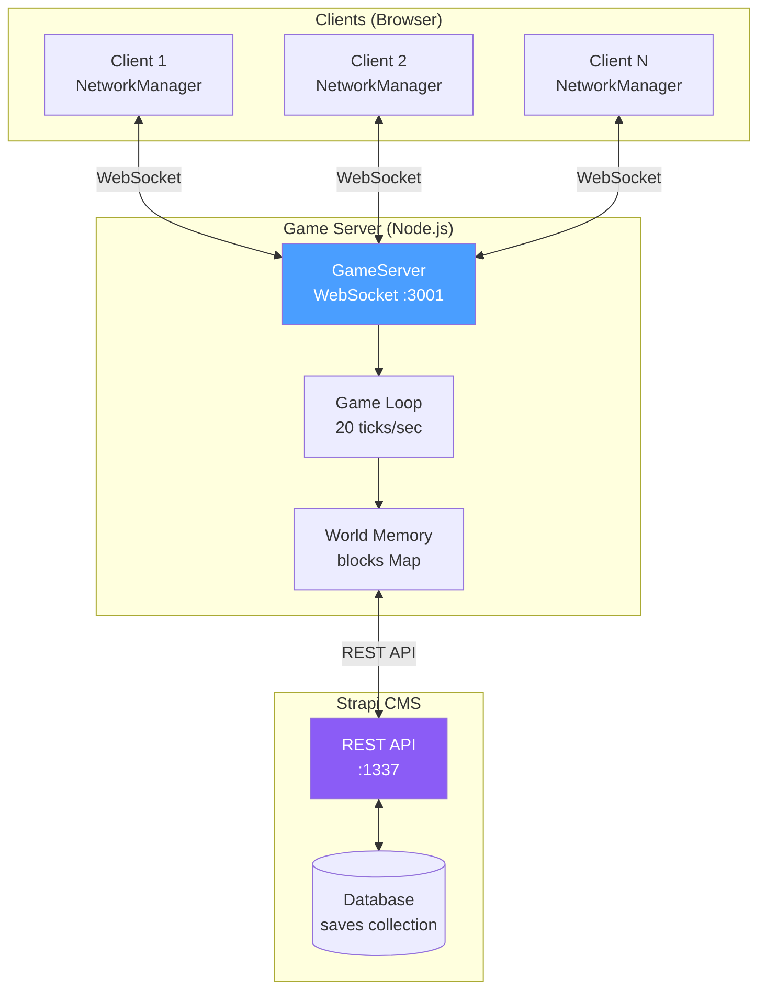

### Key Principles

1. **Server-Authoritative**: The game server is the single source of truth for ALL game state
2. **Client-Driven World Selection**: Clients specify which world to join via Strapi document ID
3. **Input-Based Sync**: Clients send inputs, server calculates positions
4. **Real-time Sync**: Block changes broadcast immediately to all connected clients
5. **Persistent Storage**: World state saved to Strapi CMS (auto-save every 10 seconds)

---

## WebSocket Communication

### What is a WebSocket?

WebSocket is a protocol that enables persistent, bidirectional communication between client and server over a single TCP connection. Unlike HTTP (request-response), WebSocket allows:

- **Server push**: Server can send data to clients anytime without a request
- **Low latency**: No HTTP overhead for each message
- **Persistent connection**: Connection stays open for the session duration

### How WebSockets Work in Grid Builder

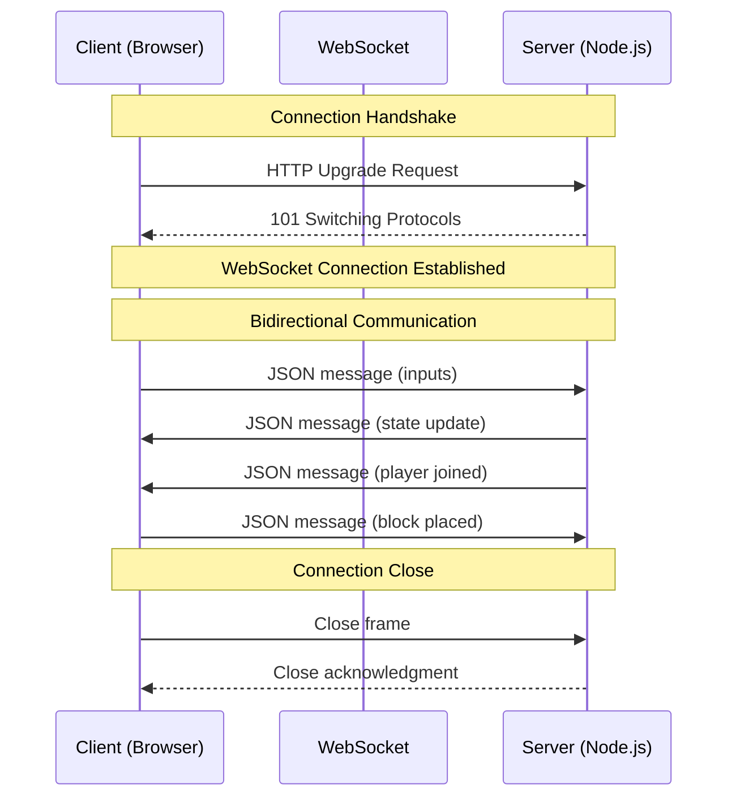

### WebSocket Lifecycle

```typescript
// Client-side WebSocket setup (NetworkManager.ts)
connect(): void {
  this.ws = new WebSocket("ws://localhost:3001");

  this.ws.onopen = () => {
    // Connection established - send join message
    this.send({ type: "client:join", worldId: this.config.worldId });
    this.startInputSending();  // Begin 20Hz input loop
    this.startPinging();       // Begin latency measurement
  };

  this.ws.onmessage = (event) => {
    // Parse and handle server messages
    const message = JSON.parse(event.data);
    this.handleMessage(message);
  };

  this.ws.onclose = () => {
    // Connection lost - attempt reconnect
    this.stopInputSending();
    this.attemptReconnect();
  };

  this.ws.onerror = (error) => {
    console.error("WebSocket error:", error);
  };
}
```

### Server-side WebSocket Setup

```typescript
// Server-side WebSocket setup (GameServer.ts)
import { WebSocketServer, WebSocket } from "ws";

class GameServer {
  private wss: WebSocketServer;

  constructor() {
    // Create WebSocket server on port 3001
    this.wss = new WebSocketServer({ port: 3001 });
    this.setupServer();
  }

  private setupServer(): void {
    this.wss.on("connection", (ws: WebSocket) => {
      // New client connected
      console.log("Client connected");

      ws.on("message", (data: Buffer) => {
        // Handle incoming message
        const message = JSON.parse(data.toString());
        this.handleMessage(ws, message);
      });

      ws.on("close", () => {
        // Client disconnected
        this.removePlayer(ws);
      });
    });
  }

  // Send message to single client
  private send(ws: WebSocket, message: object): void {
    if (ws.readyState === WebSocket.OPEN) {
      ws.send(JSON.stringify(message));
    }
  }

  // Broadcast to all clients (optionally excluding one)
  private broadcast(message: object, excludeId?: string): void {
    for (const player of this.players.values()) {
      if (player.playerId !== excludeId) {
        this.send(player.ws, message);
      }
    }
  }
}
```

### Message Flow Rates

| Direction | Message Type | Frequency | Purpose |
|-----------|--------------|-----------|---------|
| Client → Server | `player:input` | 20 Hz (every 50ms) | Player inputs (WASD, jump, etc.) |
| Client → Server | `block:placed` | On action | Block placement |
| Client → Server | `ping` | 1 Hz (every 1s) | Latency measurement |
| Server → Client | `player:state` | 20 Hz (every 50ms) | All player positions |
| Server → Client | `block:placed` | On action | Block sync to all clients |
| Server → Client | `pong` | 1 Hz | Latency response |

---

## Client State vs Server State

### The Problem: State Divergence

In multiplayer games, each client has its own local state. Without proper synchronization, clients can see different things:

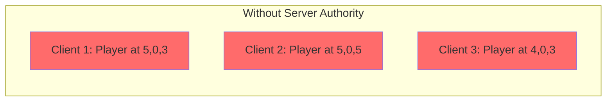

### The Solution: Server-Authoritative State

The server is the **single source of truth**. All clients receive the same state from the server:

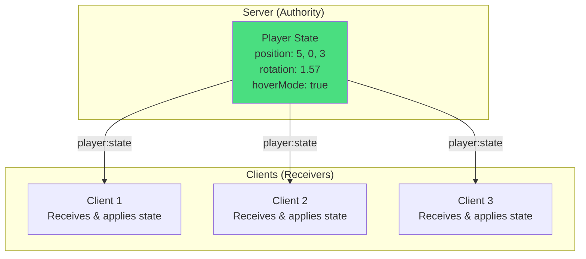

### What Lives Where

| State | Location | Why |
|-------|----------|-----|
| Player Position | **Server** | Prevents cheating, ensures consistency |
| Player Rotation | **Server** | Derived from movement direction |
| Player Velocity | **Server** | Calculated from inputs + physics |
| Hover Mode | **Server** | Affects physics (gravity), must be synced |
| Block Positions | **Server** | World state must be consistent |
| Camera Angle | **Client only** | Visual preference, sent as input for movement calc |
| UI State | **Client only** | Local user interface |
| Build Level | **Client only** | Local building preference |

### Input vs State Flow

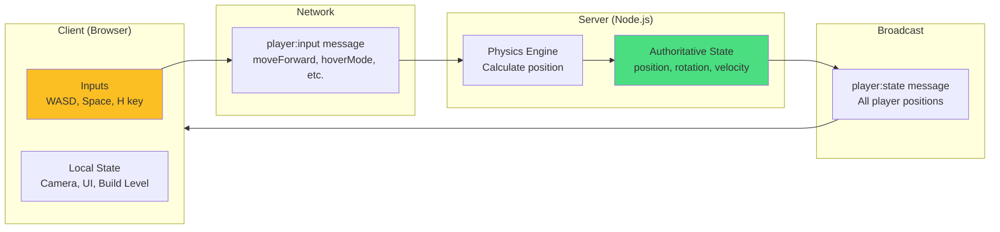

### Player Inputs Sent to Server

```typescript
interface PlayerInputs {
  // Movement keys
  moveForward: boolean;    // W key
  moveBackward: boolean;   // S key
  moveLeft: boolean;       // A key
  moveRight: boolean;      // D key

  // Vertical movement
  jetpackUp: boolean;      // Space key
  jetpackDown: boolean;    // C key

  // Modifiers
  sprint: boolean;         // Shift key
  hoverMode: boolean;      // H key toggle - disables gravity

  // Camera direction (for movement calculation)
  cameraYaw: number;       // Radians - which way camera faces
}
```

### Server Reconciliation

The server sends state back to ALL clients, including the local player. This prevents drift:

```typescript
// Client receives state update for itself
onPlayerStateUpdate: (playerId: string, state: PlayerState) => {
  if (playerId === this.localPlayerId) {
    // Apply server-authoritative position (prevents drift)
    this.playerController.setPosition(
      state.position.x,
      state.position.y,
      state.position.z
    );
    this.playerController.setRotation(state.rotation);

    // Update visual character
    this.character.setPositionFromVector(this.playerController.getPosition());
    this.character.setRotation(state.rotation);

    // Update camera to follow
    this.cameraSystem.setPlayerPosition(this.playerController.getPosition());
  } else {
    // Remote player - add to interpolation buffer
    this.remotePlayers.get(playerId)?.receiveState(state, timestamp);
  }
}
```

### Why Hover Mode Must Be Synced

Hover mode affects physics simulation. If not synced:

```
Without sync:
  Client 1: hoverMode=true  → Player hovers at Y=10
  Server:   hoverMode=false → Server calculates Y=0 (fell to ground)
  Client 2: Sees player at Y=0 (server state)

  Result: Client 1 sees themselves hovering, Client 2 sees them on ground!

With sync:
  Client 1: hoverMode=true  → Sends in player:input
  Server:   hoverMode=true  → No gravity applied, Y stays at 10
  All clients see player at Y=10 ✓
```

---

## Component Responsibilities

### Client (`src/network/NetworkManager.ts`)

| Responsibility | Description |
|---------------|-------------|
| WebSocket Connection | Establishes and maintains connection to game server |
| World Selection | Sends `client:join` with Strapi world ID |
| Input Transmission | Sends player inputs at 20 Hz (not positions) |
| State Application | Receives and applies server state to local player |
| Block Operations | Sends block placement/removal requests |
| Reconnection | Auto-reconnects on disconnect (up to 5 attempts) |

### Game Server (`server/GameServer.ts`)

| Responsibility | Description |
|---------------|-------------|
| Connection Management | Handles WebSocket connections/disconnections |
| World Loading | Loads world data from Strapi on first client join |
| Physics Simulation | Calculates player positions from inputs (20 ticks/sec) |
| State Broadcasting | Sends player states to ALL clients (including sender) |
| Block Synchronization | Broadcasts block changes to all clients |
| Persistence | Auto-saves dirty worlds to Strapi every 10 seconds |

### Strapi CMS (`localhost:1337`)

| Responsibility | Description |
|---------------|-------------|
| World Storage | Stores world data in `saves` collection |
| REST API | Provides findOne (`GET /api/saves/:id`) and update (`PUT /api/saves/:id`) endpoints |
| Data Validation | Validates world data structure |

### Client UI (`src/ui/UIManager.ts`)

| Responsibility | Description |
|---------------|-------------|
| World Selection Modal | Prompts user for Strapi world ID |
| Connection Status | Shows world name, version, and "Leave" button |
| Offline Mode | Shows "Offline Mode" when not connected |

---

## Connection Flow

### Joining a World

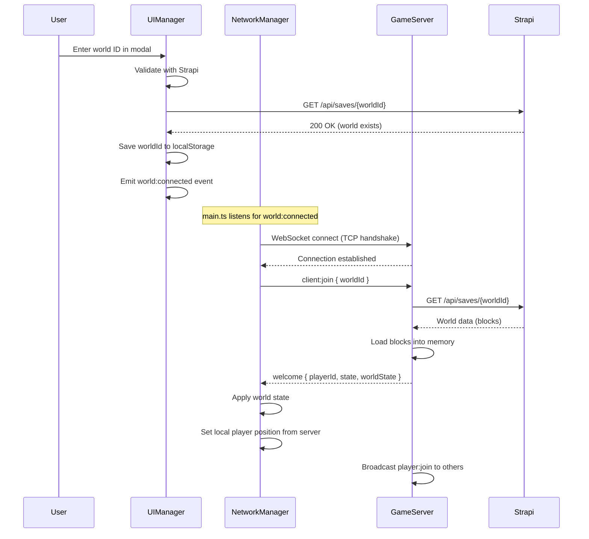

### Connection States

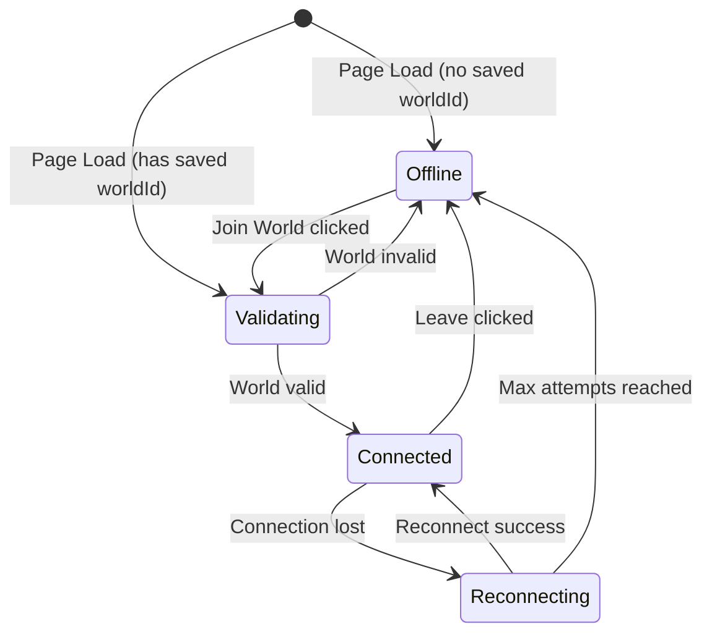

---

## World Persistence

### Data Flow

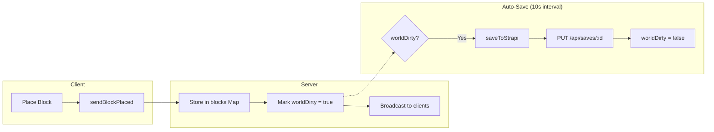

### Strapi Save Schema

```typescript
// Collection: saves
interface StrapiWorld {
  id: number;              // Internal Strapi ID
  documentId: string;      // Used for API calls (e.g., "abc123xyz")
  name: string;            // Display name (e.g., "My World")
  version: string;         // Version string (e.g., "1.0.0")
  description?: string;    // Optional description
  data: SaveData;          // JSON field containing world data
  createdAt: string;
  updatedAt: string;
}

interface SaveData {
  version: number;
  timestamp: string;
  blocks: Array<{
    blockId: string;       // Block type ID (e.g., "grass", "stone")
    x: number;
    y: number;
    z: number;
  }>;
}
```

### Save Triggers

| Trigger | Description |
|---------|-------------|
| Auto-save | Every 10 seconds if `worldDirty` is true |
| Manual save | User clicks Save button → `world:save` message |
| Server shutdown | SIGINT handler forces save before exit |

---

## Real-time Synchronization

### Player Movement (Server-Authoritative)

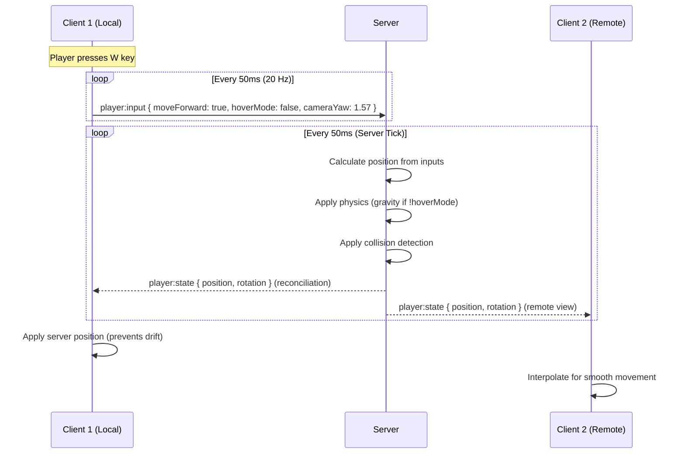

### Block Synchronization

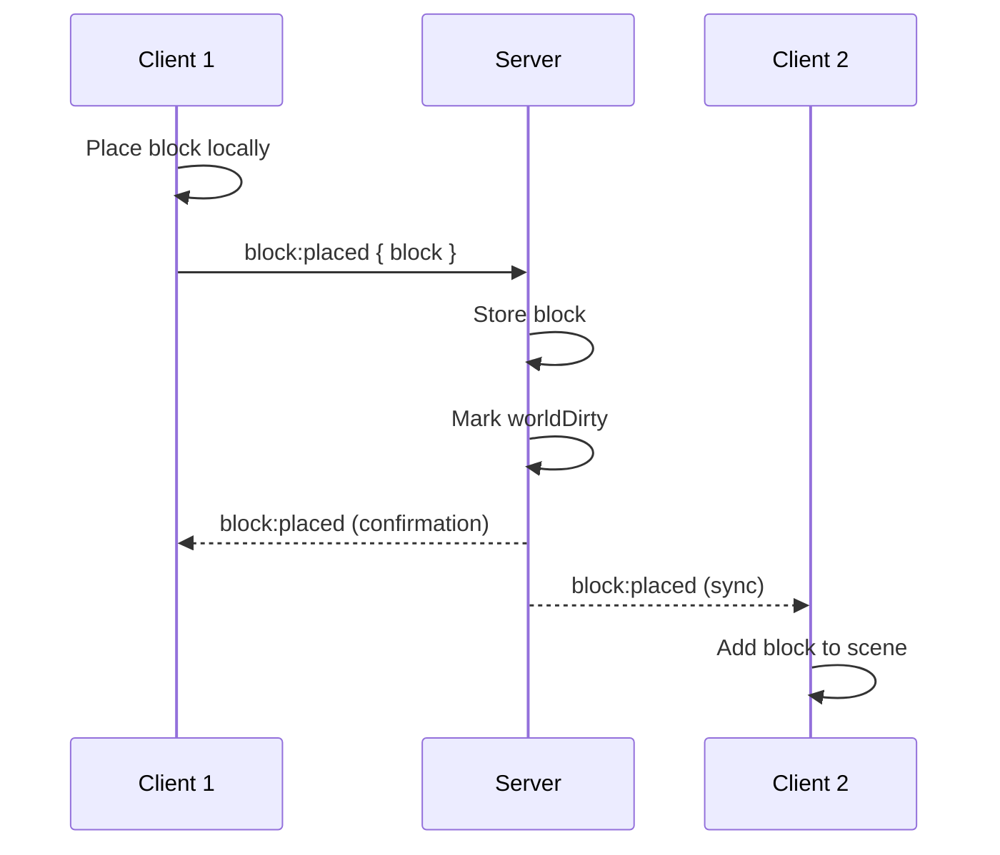

### Prefab Synchronization

Prefabs (multi-block structures) are decomposed into individual blocks for network sync:

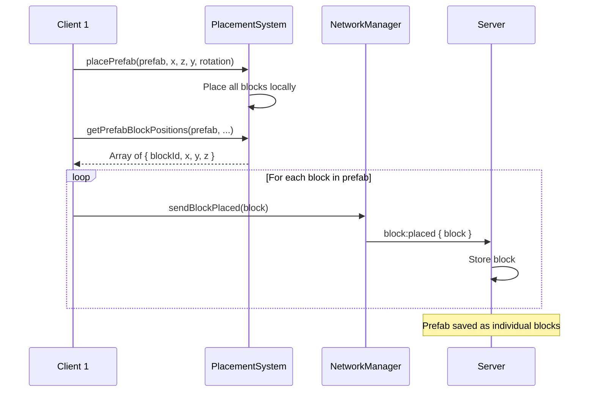

**Key Point**: Prefabs are not stored as prefabs on the server. They are decomposed into individual blocks, which allows:
- Partial deletion (remove some blocks from a prefab)
- Consistent save format (all blocks stored the same way)
- Simpler server logic (no prefab awareness needed)

---

## Message Protocol

All messages are JSON with a `type` discriminator.

### Client → Server Messages

```typescript
// Join a world (must be first message after WebSocket connect)
interface ClientJoinMessage {
  type: "client:join";
  worldId: string;  // Strapi document ID
}

// Player input (sent at 20 Hz)
interface PlayerInputMessage {
  type: "player:input";
  playerId: string;
  inputs: {
    moveForward: boolean;
    moveBackward: boolean;
    moveLeft: boolean;
    moveRight: boolean;
    jetpackUp: boolean;
    jetpackDown: boolean;
    sprint: boolean;
    hoverMode: boolean;   // Disables gravity when true
    cameraYaw: number;    // Camera direction for movement calculation
  };
  timestamp: number;
}

// Block operations
interface BlockPlacedMessage {
  type: "block:placed";
  playerId: string;
  block: { x: number; y: number; z: number; structureId: string; rotation: number };
}

interface BlockRemovedMessage {
  type: "block:removed";
  playerId: string;
  position: { x: number; y: number; z: number };
}

// World operations
interface WorldSaveRequestMessage {
  type: "world:save";
  playerId: string;
}

interface WorldResetMessage {
  type: "world:reset";
  playerId: string;
}

// Latency measurement
interface PingMessage {
  type: "ping";
  timestamp: number;
}
```

### Server → Client Messages

```typescript
// Welcome (sent after successful client:join)
interface WelcomeMessage {
  type: "welcome";
  playerId: string;
  color: string;  // Assigned player color
  state: PlayerState;  // Initial position (server-assigned)
  worldState: {
    type: "world:state";
    blocks: NetworkBlock[];
    players: NetworkPlayer[];
  };
}

// Join error (world not found)
interface JoinErrorMessage {
  type: "join:error";
  message: string;
}

// Player events
interface PlayerJoinMessage {
  type: "player:join";
  playerId: string;
  state: PlayerState;
  color: string;
}

interface PlayerLeaveMessage {
  type: "player:leave";
  playerId: string;
}

// Player state (sent to ALL clients including owner)
interface PlayerStateMessage {
  type: "player:state";
  playerId: string;
  state: PlayerState;  // position, rotation, velocity, isGrounded
  timestamp: number;
}

// Save response
interface WorldSaveResponseMessage {
  type: "world:saved";
  success: boolean;
  message?: string;
}

// Latency response
interface PongMessage {
  type: "pong";
  timestamp: number;
  serverTime: number;
}
```

---

## Client Implementation

### NetworkManager Setup

```typescript
// src/main.ts - Initialize networking
private initializeNetworking(): void {
  const worldId = getWorldId(); // From localStorage

  // No world ID = offline mode
  if (!worldId) {
    this.loadSavedGame(); // Load from localStorage
    return;
  }

  this.networkManager = new NetworkManager({
    serverUrl: "ws://localhost:3001",
    worldId,

    onConnected: (playerId, color, state) => {
      this.isMultiplayer = true;
      this.localPlayerId = playerId;

      // Sync local player position with server-assigned position
      this.playerController.setPosition(state.position.x, state.position.y, state.position.z);
      this.playerController.setRotation(state.rotation);
      this.character.setPositionFromVector(this.playerController.getPosition());
    },

    onPlayerStateUpdate: (playerId, state, timestamp) => {
      if (playerId === this.localPlayerId) {
        // Server reconciliation - apply authoritative position
        this.playerController.setPosition(state.position.x, state.position.y, state.position.z);
        this.character.setPositionFromVector(this.playerController.getPosition());
      } else {
        // Remote player - interpolate
        this.remotePlayers.get(playerId)?.receiveState(state, timestamp);
      }
    },

    onWorldState: (blocks, players) => {
      // Load blocks from server
      for (const block of blocks) {
        this.placementSystem.placeBlockFromNetwork(block.x, block.y, block.z, block.structureId, block.rotation);
      }
      // Add remote players
      for (const player of players) {
        this.addRemotePlayer(player);
      }
    },

    onBlockPlaced: (playerId, block) => {
      if (playerId !== this.localPlayerId) {
        this.placementSystem.placeBlockFromNetwork(block.x, block.y, block.z, block.structureId, block.rotation);
      }
    },
  });

  this.networkManager.connect();
}
```

### Sending Inputs (Including Hover Mode)

```typescript
// Called every frame in game loop
private sendInputsToServer(): void {
  if (!this.networkManager || !this.isMultiplayer) return;

  this.networkManager.updateInputs({
    moveForward: this.inputManager.isActionActive("moveForward"),
    moveBackward: this.inputManager.isActionActive("moveBackward"),
    moveLeft: this.inputManager.isActionActive("moveLeft"),
    moveRight: this.inputManager.isActionActive("moveRight"),
    jetpackUp: this.inputManager.isActionActive("jetpackUp"),
    jetpackDown: this.inputManager.isActionActive("jetpackDown"),
    sprint: this.inputManager.isKeyPressed("shift"),
    hoverMode: this.playerController.isHoverMode(),  // Synced to server!
  });

  // Camera yaw determines movement direction
  this.networkManager.setCameraYaw(this.cameraSystem.getYaw());
}
```

### Placing Prefabs

```typescript
// src/main.ts - Prefabs are decomposed into individual blocks for sync
private confirmPrefabPlacement(gridX: number, gridZ: number): boolean {
  const placed = this.placementSystem.placePrefab(prefab, gridX, gridZ, level, rotation);

  if (placed && this.isMultiplayer && this.networkManager) {
    // Get rotated block positions from placement system
    const blockPositions = this.placementSystem.getPrefabBlockPositions(
      prefab, gridX, gridZ, level, rotation
    );
    // Send each block individually to server
    for (const block of blockPositions) {
      this.sendBlockPlacedToServer(block.x, block.y, block.z, block.blockId);
    }
  }
  return placed;
}
```

### Remote Player Interpolation

```typescript
// src/entities/RemotePlayer.ts
export class RemotePlayer {
  private stateBuffer: StateSnapshot[] = [];
  private readonly interpolationTime = 100; // 100ms buffer

  receiveState(state: PlayerState, timestamp: number): void {
    this.stateBuffer.push({ state, timestamp });
    // Keep buffer sorted and trimmed to MAX_BUFFER_SIZE
  }

  update(deltaTime: number): void {
    const renderTime = Date.now() - this.interpolationTime;

    // Find two states to interpolate between
    // Lerp position and rotation for smooth movement
  }
}
```

---

## Server Implementation

### Connection Handling

```typescript
// server/GameServer.ts
private setupServer(): void {
  this.wss.on("connection", (ws: WebSocket) => {
    const playerId = `player_${this.nextPlayerId++}`;
    let joined = false;

    ws.on("message", async (data: Buffer) => {
      const message = JSON.parse(data.toString()) as ClientMessage;

      // Must join before any other messages
      if (message.type === "client:join") {
        const loadSuccess = await this.loadWorldById(message.worldId);

        if (!loadSuccess) {
          this.send(ws, { type: "join:error", message: "World not found" });
          ws.close();
          return;
        }

        // Create player and send welcome
        const player = { ws, playerId, state: createDefaultPlayerState(), color, inputs: null };
        this.players.set(playerId, player);
        joined = true;

        this.send(ws, {
          type: "welcome",
          playerId,
          color,
          state: player.state,
          worldState: {
            type: "world:state",
            blocks: Array.from(this.blocks.values()),
            players: this.getNetworkPlayers(playerId),
          },
        });

        // Notify other players
        this.broadcast({ type: "player:join", playerId, state: player.state, color }, playerId);
      }
    });
  });
}
```

### Physics Simulation (With Hover Mode)

```typescript
// Server game loop (20 ticks/second)
private updatePlayers(deltaTime: number): void {
  for (const player of this.players.values()) {
    if (!player.inputs) continue;

    const { state, inputs } = player;

    // Calculate movement from inputs
    let moveX = 0, moveZ = 0;
    if (inputs.moveForward) moveZ -= 1;
    if (inputs.moveBackward) moveZ += 1;
    if (inputs.moveLeft) moveX -= 1;
    if (inputs.moveRight) moveX += 1;

    // Apply camera yaw to get world-space movement
    const yaw = inputs.cameraYaw;
    const worldMoveX = -Math.sin(yaw) * -moveZ + Math.cos(yaw) * moveX;
    const worldMoveZ = -Math.cos(yaw) * -moveZ + -Math.sin(yaw) * moveX;

    // Apply speed and sprint
    const speed = inputs.sprint ? this.moveSpeed * 2 : this.moveSpeed;
    state.velocity.x = worldMoveX * speed;
    state.velocity.z = worldMoveZ * speed;

    // Vertical movement - hover mode disables gravity
    if (inputs.hoverMode) {
      // Hover: no gravity, use jetpack for vertical movement
      if (inputs.jetpackUp) {
        state.velocity.y = this.jumpForce;
      } else if (inputs.jetpackDown) {
        state.velocity.y = -this.jumpForce;
      } else {
        state.velocity.y = 0; // Hover in place
      }
      state.isGrounded = false;
    } else {
      // Normal: apply gravity
      if (inputs.jetpackUp) {
        state.velocity.y = this.jumpForce;
        state.isGrounded = false;
      } else if (!state.isGrounded) {
        state.velocity.y -= this.gravity * deltaTime;
      }
    }

    // Collision detection and position update
    this.applyMovementWithCollision(state, newX, newY, newZ);
  }
}

// Broadcast to ALL players (including owner for reconciliation)
private broadcastPlayerStates(): void {
  for (const player of this.players.values()) {
    const stateMsg = {
      type: "player:state",
      playerId: player.playerId,
      state: player.state,
      timestamp: Date.now(),
    };
    this.broadcast(stateMsg);  // No exclude - send to everyone
  }
}
```

### Strapi Integration

```typescript
// Load world from Strapi
private async loadWorldById(worldId: string): Promise<boolean> {
  try {
    const response = await fetch(`${STRAPI_SAVE_ENDPOINT}/${worldId}`);
    if (!response.ok) return false;

    const result = await response.json();
    const saveData = result.data.data;

    this.blocks.clear();
    this.strapiDocumentId = worldId;

    for (const block of saveData.blocks) {
      const key = `${block.x},${block.y},${block.z}`;
      this.blocks.set(key, { x: block.x, y: block.y, z: block.z, structureId: block.blockId, rotation: 0 });
    }

    return true;
  } catch {
    return false;
  }
}

// Save world to Strapi
private async saveToStrapi(): Promise<boolean> {
  if (!this.strapiDocumentId) return false;

  const saveData = {
    version: 1,
    timestamp: new Date().toISOString(),
    blocks: Array.from(this.blocks.values()).map(b => ({
      blockId: b.structureId, x: b.x, y: b.y, z: b.z,
    })),
  };

  const response = await fetch(`${STRAPI_SAVE_ENDPOINT}/${this.strapiDocumentId}`, {
    method: "PUT",
    headers: { "Content-Type": "application/json" },
    body: JSON.stringify({ data: { data: saveData } }),
  });

  if (response.ok) this.worldDirty = false;
  return response.ok;
}
```

---

## Strapi Configuration

### Required Collection: `saves`

Create a collection type with the following fields:

| Field | Type | Required | Description |
|-------|------|----------|-------------|
| `name` | Text | Yes | World display name |
| `version` | Text | Yes | Version string |
| `description` | Text | No | Optional description |
| `data` | JSON | Yes | World data (blocks array) |

### API Permissions

Enable the following endpoints in Settings > Roles > Public:

| Endpoint | Method | Required |
|----------|--------|----------|
| `/api/saves/:id` | GET | Yes (findOne) |
| `/api/saves/:id` | PUT | Yes (update) |
| `/api/saves` | GET | No (find - can be disabled) |
| `/api/saves` | POST | Optional (create) |

> **Note**: The `find` endpoint (`GET /api/saves`) can be disabled. The system only uses `findOne` for loading specific worlds.

### Creating a World

1. Go to Content Manager > Saves
2. Click "Create new entry"
3. Fill in:
   - **name**: "My World"
   - **version**: "1.0.0"
   - **data**: `{ "version": 1, "timestamp": "", "blocks": [] }`
4. Save and publish
5. Copy the `documentId` from the URL or info panel

---

## Running Multiplayer

```bash
# Install dependencies
npm install

# Start Strapi (separate terminal)
cd strapi && npm run develop

# Start both game server and client
npm run dev:all

# Or separately:
npm run server  # WebSocket server on :3001
npm run dev     # Vite dev server on :5173
```

### Testing Multiplayer

1. Open multiple browser windows to `http://localhost:5173`
2. In each window, click "Join World" and enter the same Strapi documentId
3. Move around and place blocks - changes sync across all windows
4. Toggle hover mode (H) - should sync across windows

---

## Troubleshooting

### "World not found" error
- Verify the documentId is correct (check Strapi admin)
- Ensure Strapi is running on port 1337
- Check that findOne API permission is enabled

### Save not working
- Verify PUT permission is enabled for `/api/saves/:id`
- Check server console for error messages
- Ensure the world was loaded successfully (strapiDocumentId is set)

### Players not syncing
- Check WebSocket connection in browser dev tools (Network → WS)
- Verify game server is running on port 3001
- Check for CORS issues if server is on different host

### Player positions don't match between clients
- Ensure server is broadcasting to ALL clients (no exclude on player:state)
- Check that client applies server state for local player (reconciliation)
- Verify hover mode is being sent in player inputs

### Hover mode doesn't sync
- Check that `hoverMode` is included in `sendInputsToServer()`
- Verify server physics handles `inputs.hoverMode` flag
- Check NetworkProtocol.ts includes `hoverMode` in PlayerInputs interface
