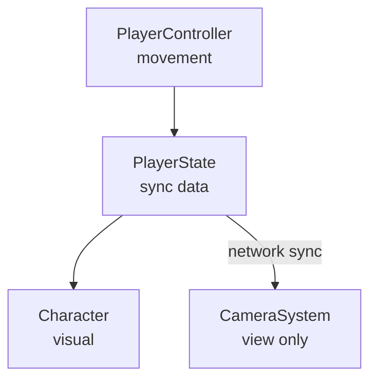

# Movement & Camera System Refactor for Multiplayer

This document explains the architectural refactor of the movement and camera systems, and why these changes were necessary to support future multiplayer functionality.

## The Problem with the Original Architecture

### Point-and-Click Pathfinding

The original system used **point-and-click pathfinding** for character movement:


While this worked well for single-player, it presents major challenges for multiplayer:

1. **Non-deterministic state**: Pathfinding algorithms can produce different results on different clients due to floating-point precision, timing, or state differences.

2. **Complex state synchronization**: Syncing a path (array of waypoints) is more complex and bandwidth-intensive than syncing simple position/velocity.

3. **Latency issues**: Click → pathfind → move creates delays that feel unresponsive in networked play.

4. **Prediction difficulty**: Hard to implement client-side prediction when movement depends on pathfinding results.

### Coupled Camera and Movement

The original `CameraSystem` in first-person mode handled both camera AND player movement:

```typescript
// Old approach - camera system does movement
class CameraSystem {
  updateFirstPerson() {
    // Handle WASD input
    // Apply movement with collision
    // Update camera position
  }
}
```

This coupling made it difficult to:
- Sync player state separately from camera state
- Have multiple players (each needs movement, but only local player needs camera)
- Serialize player state for network transmission

## The New Architecture

### Separation of Concerns

We split the system into distinct, single-responsibility components:



### PlayerState - The Sync-able Unit

```typescript
// src/core/PlayerState.ts
export interface PlayerState {
  position: { x: number; y: number; z: number };
  rotation: number;  // Y-axis facing direction
  velocity: { x: number; y: number; z: number };
  isMoving: boolean;
  isGrounded: boolean;
}
```

This interface is:
- **Serializable**: Can be converted to JSON for network transmission
- **Minimal**: Contains only essential state needed for sync
- **Deterministic**: Same inputs produce same state changes

### PlayerController - Deterministic Movement

```typescript
// src/core/PlayerController.ts
class PlayerController {
  update(deltaTime: number, cameraYaw: number): void {
    // Read input state
    // Calculate movement relative to camera direction
    // Apply physics (gravity, collision)
    // Update PlayerState
  }

  getState(): PlayerState { ... }
  setState(state: PlayerState): void { ... }  // For network sync
}
```

Key design decisions:

1. **Input-based, not click-based**: WASD movement is deterministic - same keys pressed = same movement.

2. **Camera-relative movement**: Movement direction comes from `cameraYaw` parameter, keeping movement logic separate from camera logic.

3. **setState() for sync**: Remote players' states can be applied directly without re-running movement logic.

### Character - Visual Only

```typescript
// src/entities/Character.ts
class Character {
  setPositionFromVector(position: Vector3): void { ... }
  setRotation(yaw: number): void { ... }
  setVisible(visible: boolean): void { ... }
}
```

The Character class is now purely visual:
- No movement logic
- No pathfinding
- Position set externally by PlayerController or network sync
- Can be instantiated for each player in multiplayer

### CameraSystem - Three Modes

```typescript
// src/systems/CameraSystem.ts
type CameraMode = "first-person" | "third-person" | "build";
```

| Mode | Camera Behavior | Player Movement |
|------|-----------------|-----------------|
| First-person | At player eye level, mouse look | PlayerController handles |
| Third-person | Orbits behind player | PlayerController handles |
| Build | Orbits around ghost block | Camera moves independently |

The camera no longer handles movement - it only handles view.

## Why This Enables Multiplayer

### 1. Simple State Sync

```typescript
// Send local player state to server
const state = playerController.getState();
socket.emit('playerState', state);

// Receive remote player state
socket.on('remotePlayer', (state) => {
  remoteCharacter.setPositionFromVector(state.position);
  remoteCharacter.setRotation(state.rotation);
});
```

### 2. Client-Side Prediction

```typescript
// Local player: predict immediately
playerController.update(deltaTime, cameraYaw);
character.setPositionFromVector(playerController.getPosition());

// When server confirms, reconcile if needed
socket.on('serverState', (state) => {
  if (statesDiffer(playerController.getState(), state)) {
    playerController.setState(state);  // Server is authoritative
  }
});
```

### 3. Interpolation for Remote Players

```typescript
// Remote players: interpolate between received states
class RemotePlayer {
  previousState: PlayerState;
  targetState: PlayerState;

  update(t: number) {
    position = lerp(previousState.position, targetState.position, t);
    character.setPositionFromVector(position);
  }
}
```

### 4. Server Authority

The server can run the same `PlayerController` logic to validate client inputs:

```typescript
// Server-side
playerController.update(deltaTime, clientInput.cameraYaw);
const serverState = playerController.getState();

// Broadcast authoritative state to all clients
broadcast('playerState', { id: playerId, state: serverState });
```

## File Changes Summary

| File | Change |
|------|--------|
| `src/core/PlayerState.ts` | **New** - Serializable state interface |
| `src/core/PlayerController.ts` | **New** - Unified movement controller |
| `src/core/StateManager.ts` | Added `CameraMode`, unified mode management |
| `src/systems/CameraSystem.ts` | Rewritten - view only, three modes |
| `src/entities/Character.ts` | Simplified - visual only, no pathfinding |
| `src/main.ts` | Updated game loop integration |

## Future Multiplayer Implementation

With this architecture in place, adding multiplayer requires:

1. **WebSocket connection** to game server
2. **Input transmission** - send local inputs to server
3. **State reception** - receive authoritative state from server
4. **Remote player rendering** - create Character instances for other players
5. **Interpolation layer** - smooth remote player movement

The core game logic (PlayerController, collision detection, etc.) remains unchanged.
