# Save System Documentation

This document provides a comprehensive guide to the save system, explaining how game state is persisted to browser localStorage and Strapi backend, the data structures involved, and the fallback mechanisms.

## Overview

The save system allows players to:
- **Save** their placed blocks to Strapi (cloud) or localStorage (offline fallback)
- **Auto-load** saved blocks when the game starts
- **Reset** the world by clearing all blocks and deleting the save
- **Automatic fallback** to localStorage when Strapi is unavailable

```mermaid
flowchart LR
    subgraph Game
        A[PlacementSystem] --> B[exportBlocks]
        C[importBlocks] --> A
    end

    subgraph SaveSystem
        B --> D{Strapi Available?}
        D -->|Yes| E[saveToStrapi]
        D -->|No| F[saveGame]
        E --> G[(Strapi DB)]
        E --> H[localStorage cache]
        F --> H

        I{Load Source}
        I -->|Strapi| J[loadFromStrapi]
        I -->|Local| K[loadGame]
        J --> G
        J -->|Fallback| K
        K --> H
        J --> C
        K --> C
    end

    subgraph UI
        L[☁️/💾 Save Button] --> D
        M[Reset Button] --> N[deleteFromStrapi]
        N --> G
        N --> H
    end
```



## Architecture

### System Components


### File Structure

```
src/
├── core/
│   └── SaveSystem.ts      # Save/load logic and localStorage interface
├── structures/
│   └── PlacementSystem.ts # Block storage with export/import methods
├── ui/
│   └── UIManager.ts       # Message display
└── main.ts                # Game class with save controls
```

## Data Structures

### SavedBlock

Represents a single block in the save file:

```typescript
interface SavedBlock {
  blockId: string;   // Block type identifier (e.g., "block_red")
  x: number;         // Grid X position
  y: number;         // Grid Y position (height/level)
  z: number;         // Grid Z position
}
```

**Example:**
```json
{ "blockId": "block_gray", "x": 5, "y": 0, "z": 10 }
```

This represents a gray block at grid position (5, 0, 10) - ground level.

### SaveData

Complete save file structure:

```typescript
interface SaveData {
  version: number;    // Format version for future migrations
  timestamp: string;  // ISO 8601 date string
  blocks: SavedBlock[];
}
```

**Example save file:**
```json
{
  "version": 1,
  "timestamp": "2024-12-04T15:30:45.123Z",
  "blocks": [
    { "blockId": "block_gray", "x": 5, "y": 0, "z": 10 },
    { "blockId": "block_gray", "x": 5, "y": 1, "z": 10 },
    { "blockId": "block_red", "x": 5, "y": 2, "z": 10 },
    { "blockId": "block_gray", "x": 6, "y": 0, "z": 10 },
    { "blockId": "block_blue", "x": 6, "y": 0, "z": 11 }
  ]
}
```

## Save Flow

### Saving the Game


### Code Walkthrough: Export Blocks

```typescript
// PlacementSystem.ts

exportBlocks(): Array<{ blockId: string; x: number; y: number; z: number }> {
  const blocks: Array<{ blockId: string; x: number; y: number; z: number }> = [];

  // Iterate through all occupied cells
  // occupiedCells is a Set<string> with keys like "5,0,10"
  for (const key of this.occupiedCells) {
    // Get the block type at this position
    const blockId = this.cellBlockIds.get(key);

    if (blockId) {
      // Parse the key back to coordinates
      const [x, y, z] = key.split(",").map(Number);
      blocks.push({ blockId, x, y, z });
    }
  }

  return blocks;
}
```

**How it works:**

1. `occupiedCells` is a `Set<string>` containing keys like `"5,0,10"`
2. `cellBlockIds` is a `Map<string, string>` mapping keys to block types
3. For each occupied cell, we look up its block type and parse coordinates
4. Return array of all blocks with their positions

### Code Walkthrough: Save to localStorage

```typescript
// SaveSystem.ts

const SAVE_VERSION = 1;
const SAVE_KEY = "voxel_game_save";

export function saveGame(blocks: SavedBlock[]): boolean {
  try {
    // Create the save data structure
    const saveData: SaveData = {
      version: SAVE_VERSION,
      timestamp: new Date().toISOString(),
      blocks: blocks,
    };

    // Serialize to JSON and store
    localStorage.setItem(SAVE_KEY, JSON.stringify(saveData));

    // Emit event for other systems to react
    emitEvent("game:saved", {
      blockCount: blocks.length,
      timestamp: saveData.timestamp
    });

    return true;
  } catch (error) {
    console.error("Failed to save game:", error);
    return false;
  }
}
```

## Load Flow

### Loading the Game


### Code Walkthrough: Import Blocks

```typescript
// PlacementSystem.ts

importBlocks(blocks: Array<{ blockId: string; x: number; y: number; z: number }>): number {
  let importedCount = 0;

  for (const block of blocks) {
    // Look up the structure definition for this block type
    const structure = getStructure(block.blockId);
    if (!structure) {
      console.warn(`Unknown block type: ${block.blockId}`);
      continue;
    }

    // Check if cell is already occupied (skip duplicates)
    const key = cellKey3D(block.x, block.y, block.z);
    if (this.occupiedCells.has(key)) {
      continue;
    }

    // Create the visual mesh for this block
    const mesh = this.createStructureMesh(structure, false);
    mesh.position.set(
      block.x * this.cellSize + this.cellSize / 2,
      block.y * this.cellSize + this.cellSize / 2,
      block.z * this.cellSize + this.cellSize / 2
    );
    this.scene.add(mesh);

    // Update tracking data structures
    this.occupiedCells.add(key);
    this.cellBlockIds.set(key, block.blockId);

    // Update height map for collision detection
    const heightKey = `${block.x},${block.z}`;
    const currentHeight = this.heightMap.get(heightKey) || 0;
    this.heightMap.set(heightKey, Math.max(currentHeight, block.y + 1));

    // Store as placed structure for removal support
    const structureId = `${block.blockId}_${Date.now()}_${importedCount}`;
    this.placedStructures.set(structureId, {
      id: structureId,
      definition: structure,
      gridX: block.x,
      gridY: block.y,
      gridZ: block.z,
      mesh,
    });

    importedCount++;
  }

  return importedCount;
}
```

**Step-by-step breakdown:**


## Reset Flow

### Resetting the Game


### Code Walkthrough: Clear All Blocks

```typescript
// PlacementSystem.ts

clearAll(): void {
  // Remove all meshes from the Three.js scene
  for (const structure of this.placedStructures.values()) {
    // Remove from scene
    this.scene.remove(structure.mesh);

    // Properly dispose of Three.js resources to prevent memory leaks
    structure.mesh.traverse((child) => {
      if (child instanceof THREE.Mesh) {
        child.geometry.dispose();
        if (child.material instanceof THREE.Material) {
          child.material.dispose();
        }
      }
    });
  }

  // Clear all tracking data structures
  this.placedStructures.clear();  // Map of structure ID -> PlacedStructure
  this.occupiedCells.clear();     // Set of "x,y,z" keys
  this.cellBlockIds.clear();      // Map of "x,y,z" -> blockId
  this.heightMap.clear();         // Map of "x,z" -> max height
}
```

## localStorage Details

### Storage Location

The save is stored in the browser's localStorage under the key `voxel_game_save`.

**To inspect in browser DevTools:**
1. Open DevTools (F12)
2. Go to Application tab
3. Expand Local Storage in sidebar
4. Click on your site's origin
5. Find the `voxel_game_save` key

### Storage Limits

- localStorage has a ~5MB limit per origin
- Each block takes approximately 50-80 bytes in JSON
- You can store roughly **60,000-100,000 blocks** before hitting limits

```typescript
// Rough calculation
const blockJson = JSON.stringify({ blockId: "block_gray", x: 100, y: 10, z: 100 });
console.log(blockJson.length); // ~52 characters = ~52 bytes

const maxBlocks = 5_000_000 / 60; // ~83,000 blocks
```

### Version Migration

The save system includes a version number for future migrations:

```typescript
export function loadGame(): SaveData | null {
  try {
    const saved = localStorage.getItem(SAVE_KEY);
    if (!saved) return null;

    const saveData: SaveData = JSON.parse(saved);

    // Version check for migrations
    if (saveData.version !== SAVE_VERSION) {
      console.warn(`Save version mismatch: expected ${SAVE_VERSION}, got ${saveData.version}`);

      // Future: Add migration logic here
      // if (saveData.version === 1) {
      //   saveData = migrateV1toV2(saveData);
      // }
    }

    return saveData;
  } catch (error) {
    console.error("Failed to load game:", error);
    return null;
  }
}
```

## Event System Integration

The save system emits events that other systems can listen to:

```typescript
// Events emitted by SaveSystem
"game:saved"  -> { blockCount: number, timestamp: string }
"game:loaded" -> { blockCount: number, timestamp: string }
"game:reset"  -> void
```

**Listening to save events:**

```typescript
import { onEvent } from "./core/EventBus";

// React to game being saved
onEvent("game:saved", ({ blockCount, timestamp }) => {
  console.log(`Saved ${blockCount} blocks at ${timestamp}`);
});

// React to game being loaded
onEvent("game:loaded", ({ blockCount, timestamp }) => {
  console.log(`Loaded ${blockCount} blocks from ${timestamp}`);
});

// React to game reset
onEvent("game:reset", () => {
  console.log("Game was reset");
});
```

## UI Integration

### Button Setup

```html
<!-- index.html -->
<div id="save-controls">
  <button id="save-btn" class="save-btn" title="Save current world">Save</button>
  <button id="reset-btn" class="reset-btn" title="Clear all blocks">Reset</button>
</div>
```

### Button Handlers

```typescript
// main.ts - Game class

private setupSaveControls(): void {
  const saveBtn = document.getElementById("save-btn");
  const resetBtn = document.getElementById("reset-btn");

  saveBtn?.addEventListener("click", () => {
    this.saveCurrentGame();
  });

  resetBtn?.addEventListener("click", () => {
    // Confirm before destructive action
    if (confirm("Are you sure you want to reset? This will delete all placed blocks.")) {
      this.resetGame();
    }
  });
}

private saveCurrentGame(): void {
  // Export blocks from PlacementSystem
  const blocks = this.placementSystem.exportBlocks() as SavedBlock[];

  // Save to localStorage
  const success = saveGame(blocks);

  // Show feedback to user
  if (success) {
    this.uiManager?.showMessage(`Saved ${blocks.length} blocks`, 2000);
  } else {
    this.uiManager?.showMessage("Failed to save", 2000);
  }
}

private loadSavedGame(): void {
  // Check if save exists
  if (!hasSave()) return;

  // Load save data
  const saveData = loadGame();

  if (saveData && saveData.blocks.length > 0) {
    // Import blocks into PlacementSystem
    const count = this.placementSystem.importBlocks(saveData.blocks);
    console.log(`Loaded ${count} blocks from save`);
  }
}

private resetGame(): void {
  // Clear all blocks from scene
  this.placementSystem.clearAll();

  // Delete the save file
  deleteSave();

  // Show feedback
  this.uiManager?.showMessage("World reset", 2000);
}
```

## Complete Data Flow Diagram


## Strapi Integration

The save system uses Strapi as the primary backend with localStorage as a fallback/cache.

```mermaid
flowchart TB
    subgraph Startup
        A[Game Initialize] --> B[isStrapiAvailable]
        B -->|200 OK| C[strapiAvailable = true]
        B -->|Error/Timeout| D[strapiAvailable = false]
    end

    subgraph Save Flow
        E[User clicks Save] --> F{strapiAvailable?}
        F -->|Yes| G[saveToStrapi]
        F -->|No| H[saveGame localStorage]
        G -->|Success| I[Cache to localStorage]
        G -->|Fail| H
        I --> J[Show "Saved to cloud"]
        H --> K[Show "Saved locally"]
    end

    subgraph Load Flow
        L[Game Start] --> M{strapiAvailable?}
        M -->|Yes| N[loadFromStrapi]
        M -->|No| O[loadGame localStorage]
        N -->|Success| P[Cache to localStorage]
        N -->|Fail| O
        P --> Q[Import blocks]
        O --> Q
    end
```

### Strapi Collection Schema

Create a `Save` collection type in Strapi with this structure:

```json
{
  "kind": "collectionType",
  "collectionName": "saves",
  "info": {
    "singularName": "save",
    "pluralName": "saves",
    "displayName": "Save"
  },
  "attributes": {
    "data": {
      "type": "json"
    }
  }
}
```

The `data` JSON field stores the complete `SaveData` object:

```json
{
  "data": {
    "version": 1,
    "timestamp": "2024-12-04T15:30:45.123Z",
    "blocks": [
      { "blockId": "block_gray", "x": 5, "y": 0, "z": 10 },
      { "blockId": "block_red", "x": 5, "y": 1, "z": 10 }
    ]
  }
}
```

### API Endpoints

| Method | Endpoint | Description |
|--------|----------|-------------|
| GET | `/api/saves` | List all saves (with pagination) |
| GET | `/api/saves/:documentId` | Get specific save by documentId |
| POST | `/api/saves` | Create new save |
| PUT | `/api/saves/:documentId` | Update existing save |
| DELETE | `/api/saves/:documentId` | Delete save |

### Strapi Permission Setup

Enable public access in Strapi Admin:
1. Go to **Settings → Users & Permissions → Roles → Public**
2. Find the **Save** collection
3. Enable: `find`, `findOne`, `create`, `update`, `delete`
4. Click **Save**

### Code: Save to Strapi

```typescript
// SaveSystem.ts

const STRAPI_URL = "http://localhost:1337";
const STRAPI_SAVE_ENDPOINT = `${STRAPI_URL}/api/saves`;

// Track current save's documentId for updates
let currentSaveDocumentId: string | null = null;

export async function saveToStrapi(blocks: SavedBlock[]): Promise<boolean> {
  try {
    const saveData: SaveData = {
      version: SAVE_VERSION,
      timestamp: new Date().toISOString(),
      blocks: blocks,
    };

    let response: Response;

    if (currentSaveDocumentId) {
      // Update existing save
      response = await fetch(`${STRAPI_SAVE_ENDPOINT}/${currentSaveDocumentId}`, {
        method: "PUT",
        headers: { "Content-Type": "application/json" },
        body: JSON.stringify({ data: { data: saveData } }),
      });
    } else {
      // Create new save
      response = await fetch(STRAPI_SAVE_ENDPOINT, {
        method: "POST",
        headers: { "Content-Type": "application/json" },
        body: JSON.stringify({ data: { data: saveData } }),
      });
    }

    if (!response.ok) return false;

    const result = await response.json();
    currentSaveDocumentId = result.data.documentId;

    // Cache to localStorage
    localStorage.setItem(SAVE_KEY, JSON.stringify(saveData));

    return true;
  } catch (error) {
    console.error("Failed to save to Strapi:", error);
    return false;
  }
}
```

### Code: Load from Strapi

```typescript
export async function loadFromStrapi(): Promise<SaveData | null> {
  try {
    // Get most recent save (or specific save if we have documentId)
    const url = currentSaveDocumentId
      ? `${STRAPI_SAVE_ENDPOINT}/${currentSaveDocumentId}`
      : `${STRAPI_SAVE_ENDPOINT}?sort=updatedAt:desc&pagination[limit]=1`;

    const response = await fetch(url);
    if (!response.ok) {
      return loadGame(); // Fallback to localStorage
    }

    const result = await response.json();

    // Handle single vs list response
    let saveEntry;
    if (currentSaveDocumentId) {
      saveEntry = result.data;
    } else {
      if (!result.data || result.data.length === 0) {
        return loadGame(); // No saves in Strapi, try localStorage
      }
      saveEntry = result.data[0];
    }

    // Store documentId for future updates
    currentSaveDocumentId = saveEntry.documentId;

    const saveData = saveEntry.data;

    // Cache to localStorage
    localStorage.setItem(SAVE_KEY, JSON.stringify(saveData));

    return saveData;
  } catch (error) {
    console.warn("Strapi unavailable, using localStorage:", error);
    return loadGame();
  }
}
```

### Code: Check Strapi Availability

```typescript
export async function isStrapiAvailable(): Promise<boolean> {
  try {
    // Check the saves endpoint directly since /api may return 404
    const response = await fetch(STRAPI_SAVE_ENDPOINT, { method: "HEAD" });
    return response.ok;
  } catch {
    return false;
  }
}
```

> **Note:** We check `/api/saves` instead of `/api` because the base `/api` endpoint returns 404 in Strapi.

### UI Indicator

The save button shows connection status:
- **☁️ Save** - Connected to Strapi (saves to cloud)
- **💾 Save** - Offline mode (saves to localStorage only)

```typescript
// main.ts
private updateSaveButtonState(): void {
  const saveBtn = document.getElementById("save-btn");
  if (saveBtn) {
    const icon = this.strapiAvailable ? "☁️" : "💾";
    saveBtn.textContent = `${icon} Save`;
  }
}
```

### Strapi Response Types

```typescript
interface StrapiSaveResponse {
  data: {
    id: number;
    documentId: string;
    data: SaveData;
    createdAt: string;
    updatedAt: string;
  };
}

interface StrapiSaveListResponse {
  data: Array<{
    id: number;
    documentId: string;
    data: SaveData;
    createdAt: string;
    updatedAt: string;
  }>;
}
```

### Offline/Online Flow


## Troubleshooting

### Save Not Working

1. **Check localStorage availability:**
```javascript
if (typeof localStorage === 'undefined') {
  console.error('localStorage not available');
}
```

2. **Check storage quota:**
```javascript
try {
  localStorage.setItem('test', 'x'.repeat(5_000_000));
} catch (e) {
  console.error('Storage quota exceeded');
}
```

3. **Inspect current save:**
```javascript
const save = localStorage.getItem('voxel_game_save');
console.log(JSON.parse(save));
```

### Blocks Not Loading

1. **Check if save exists:**
```javascript
console.log('Has save:', localStorage.getItem('voxel_game_save') !== null);
```

2. **Validate save format:**
```javascript
const save = JSON.parse(localStorage.getItem('voxel_game_save'));
console.log('Version:', save.version);
console.log('Block count:', save.blocks.length);
console.log('First block:', save.blocks[0]);
```

3. **Check for unknown block types:**
```javascript
const save = JSON.parse(localStorage.getItem('voxel_game_save'));
const unknownTypes = save.blocks
  .map(b => b.blockId)
  .filter(id => !getStructure(id));
console.log('Unknown block types:', [...new Set(unknownTypes)]);
```

### Clear Corrupted Save

```javascript
localStorage.removeItem('voxel_game_save');
location.reload();
```

## Related Documentation

- [Grid-Based Collision System](./grid-based-collision.md) - How blocks are stored in 3D grid
- [Prefab Capture System](./prefab-capture-system.md) - How prefabs use similar block storage
