# Should We Move WebSocket Server into Strapi?

This document analyzes whether to move the game server's WebSocket functionality directly into Strapi, exposing it via custom routes.

---

## Architecture Comparison

### Current Architecture (Separate Servers)

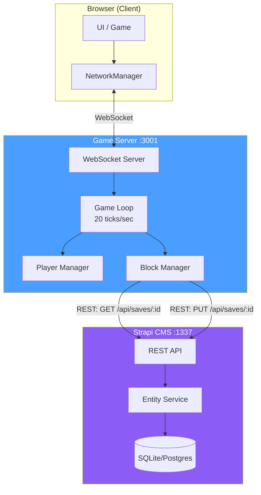

### Proposed Architecture (Strapi Integrated)

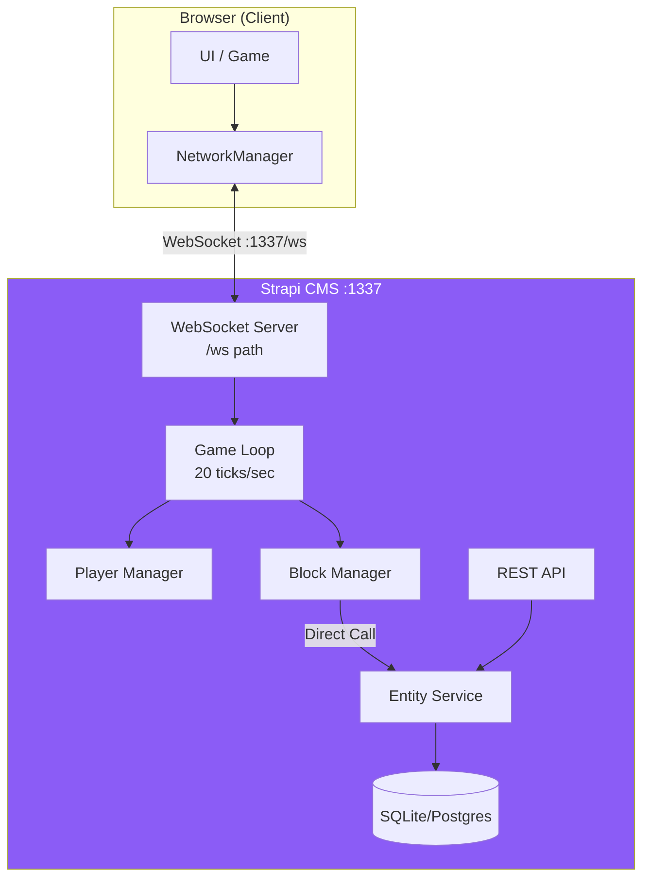

---

## Data Flow Comparison

### Current: REST API for Persistence

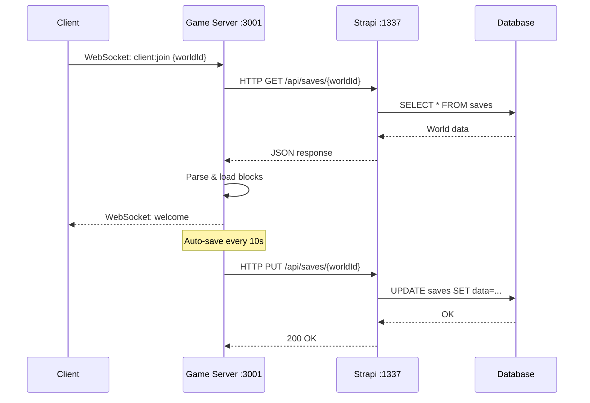

### Proposed: Direct Entity Service

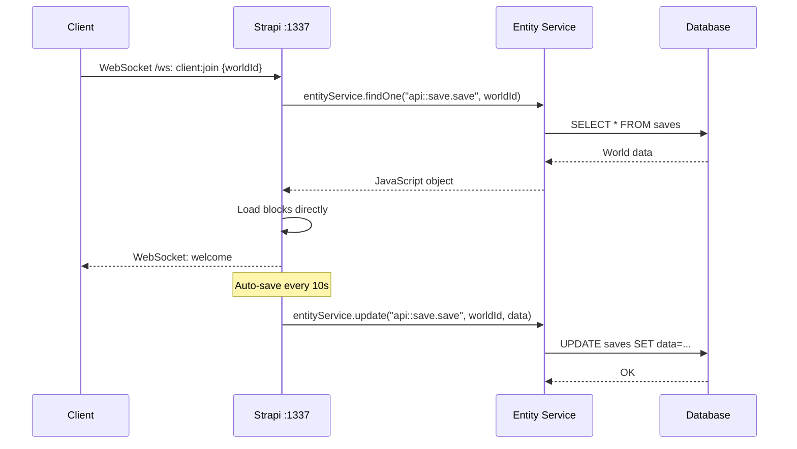

---

## How to Implement in Strapi

### Bootstrap WebSocket Server

```typescript
// src/index.ts (Strapi app entry)
import { WebSocketServer } from "ws";

export default {
  register() {},

  bootstrap({ strapi }) {
    // Get the underlying HTTP server from Strapi
    const httpServer = strapi.server.httpServer;

    // Attach WebSocket server to same port, different path
    const wss = new WebSocketServer({ server: httpServer, path: "/ws" });

    wss.on("connection", (ws) => {
      ws.on("message", async (data) => {
        const message = JSON.parse(data.toString());

        if (message.type === "client:join") {
          // Direct database access via Strapi Entity Service
          const world = await strapi.entityService.findOne(
            "api::save.save",
            message.worldId
          );
          // ... handle connection
        }
      });
    });

    // Store reference for use elsewhere
    strapi.wss = wss;
  },
};
```

### Game Loop Integration

```typescript
// In Strapi bootstrap
let players = new Map();
let blocks = new Map();
let worldId = null;

// Start game loop (20 ticks/sec)
setInterval(() => {
  updatePlayers(0.05);
  broadcastPlayerStates();
}, 50);

// Save to database directly (no HTTP overhead)
async function saveWorld() {
  if (!worldId) return;

  await strapi.entityService.update("api::save.save", worldId, {
    data: {
      data: {
        version: 1,
        timestamp: new Date().toISOString(),
        blocks: Array.from(blocks.values()),
      },
    },
  });
}
```

---

## Pros and Cons

### Pros of Moving to Strapi

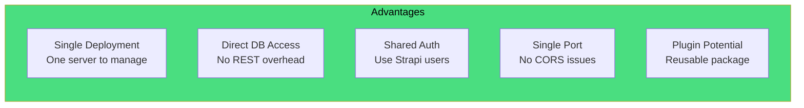

| Benefit | Description |
|---------|-------------|
| **Single deployment** | One server to manage instead of two |
| **Direct DB access** | No REST API overhead - use `strapi.entityService` directly |
| **Shared authentication** | Use Strapi's auth system for players |
| **Single port** | Simpler networking, no CORS between servers |
| **Plugin ecosystem** | Could create a reusable "game server" plugin |
| **Simpler dev setup** | One `npm run develop` instead of two servers |

### Cons of Moving to Strapi

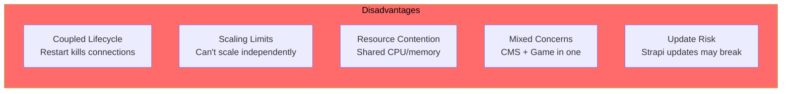

| Drawback | Description |
|----------|-------------|
| **Coupled to Strapi** | Game server lifecycle tied to CMS |
| **Scaling limits** | Can't scale game server independently from CMS |
| **Strapi overhead** | CMS features you don't need running alongside game loop |
| **Restart impact** | Strapi restart (e.g., content type change) kills all game connections |
| **Memory contention** | Game loop + CMS compete for resources |
| **Debugging complexity** | Game issues mixed with CMS issues in logs |
| **Update risk** | Strapi updates could break custom WebSocket code |

---

## Scaling Comparison

### Current: Independent Scaling

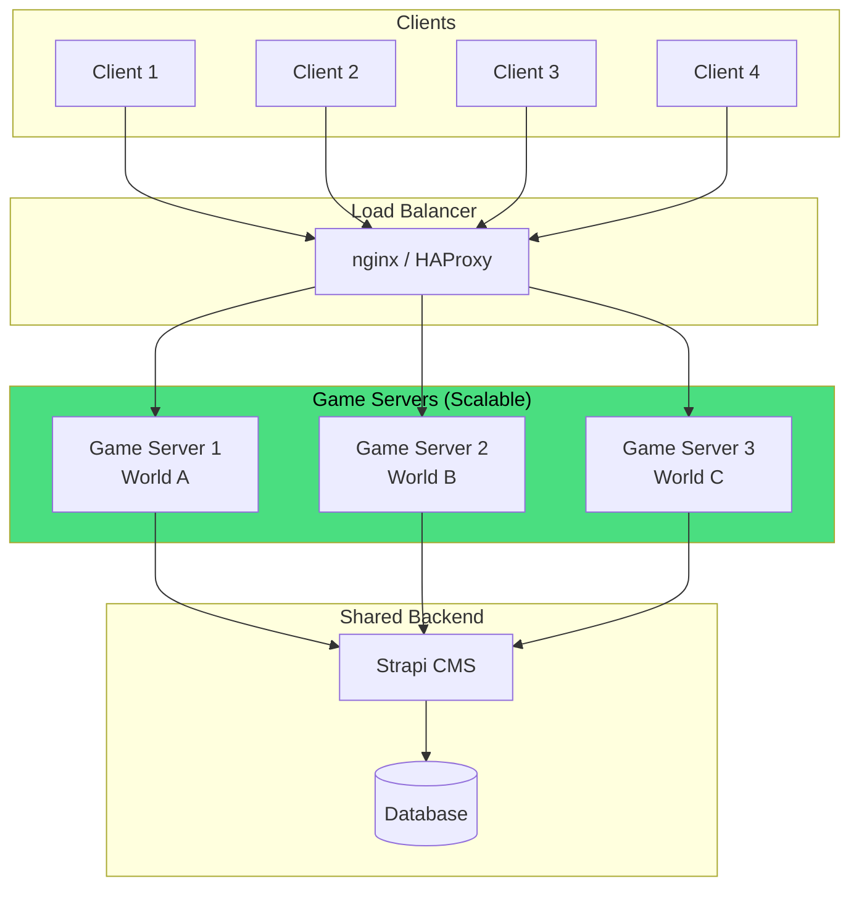

### Proposed: Coupled Scaling

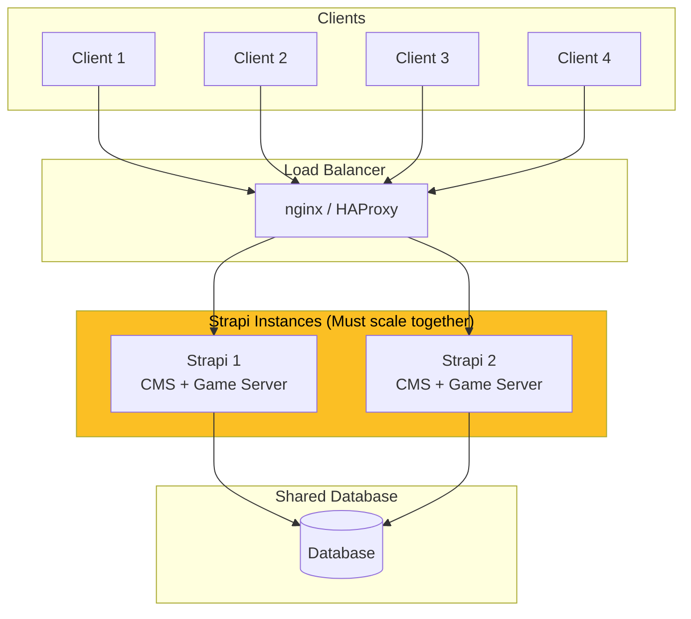

**Problem**: With Strapi integration, you can't scale game servers without also scaling the CMS. Each instance needs to sync player state, adding complexity.

---

## Restart Impact Comparison

### Current: Isolated Restarts

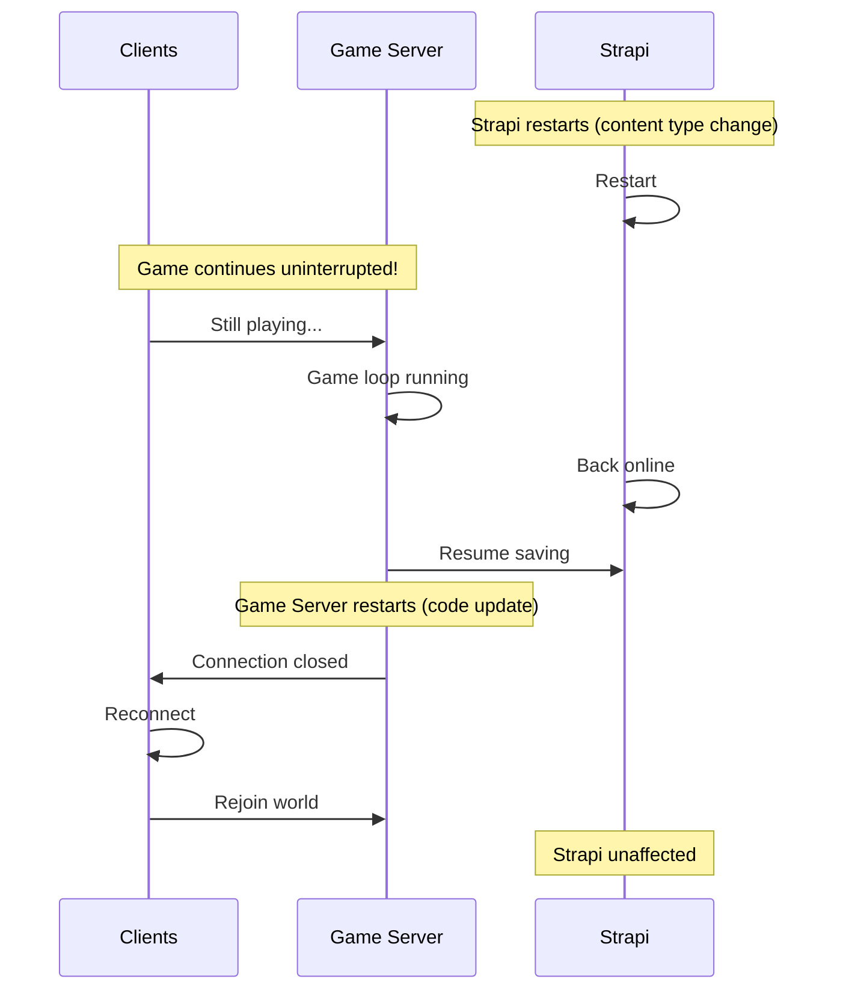

### Proposed: Coupled Restarts

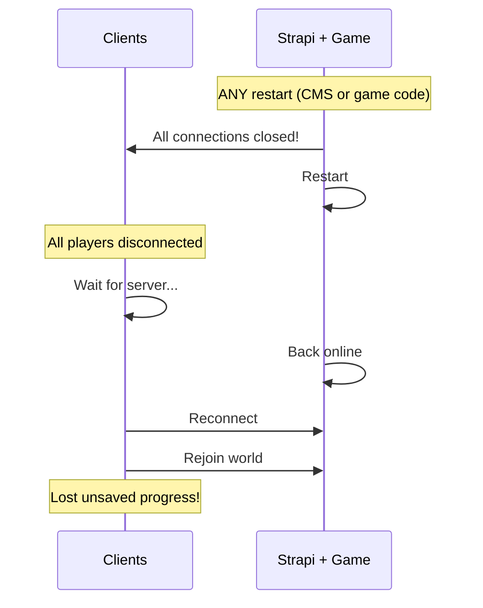

---

## Comparison Summary

| Factor | Separate Server | Strapi Integrated |
|--------|-----------------|-------------------|
| Deployment | 2 servers | 1 server |
| Scaling | Independent | Coupled |
| DB access | REST API calls | Direct entityService |
| Ports | 2 (3001, 1337) | 1 (1337) |
| Memory | Separate processes | Shared process |
| Restart impact | Independent | All connections lost |
| Code organization | Clean separation | Mixed concerns |
| Save latency | ~5-10ms (HTTP) | ~1-2ms (direct) |
| Debugging | Separate logs | Mixed logs |

---

## Hybrid Approach (Best of Both)

A middle ground: Use Strapi as a "connection broker" while keeping the game server separate:

```mermaid
graph TB
    subgraph Browser["Browser"]
        UI[UI]
        NM[NetworkManager]
    end

    subgraph Strapi["Strapi :1337"]
        API[REST API]
        VAL[World Validator]
        ES[Entity Service]
        DB[(Database)]
    end

    subgraph GameServer["Game Server :3001"]
        WS[WebSocket]
        GL[Game Loop]
    end

    UI -->|1. GET /game/server/:worldId| API
    API --> VAL
    VAL --> ES
    ES --> DB
    API -->|2. Return {wsUrl, worldId}| UI
    UI --> NM
    NM -->|3. WebSocket connect| WS
    WS --> GL
    GL -->|4. Save blocks| API

    style Strapi fill:#8b5cf6,color:#fff
    style GameServer fill:#4a9eff,color:#fff
```

### Implementation

```typescript
// Strapi custom controller: src/api/game/controllers/game.ts
export default {
  async getGameServer(ctx) {
    const { worldId } = ctx.params;

    // Validate world exists
    const world = await strapi.entityService.findOne(
      "api::save.save",
      worldId,
      { fields: ["documentId", "name", "version"] }
    );

    if (!world) {
      return ctx.notFound("World not found");
    }

    // Return game server connection info
    return {
      websocketUrl: process.env.GAME_SERVER_URL || "ws://localhost:3001",
      worldId: world.documentId,
      name: world.name,
      version: world.version,
    };
  },
};
```

```typescript
// Strapi custom route: src/api/game/routes/game.ts
export default {
  routes: [
    {
      method: "GET",
      path: "/game/server/:worldId",
      handler: "game.getGameServer",
      config: {
        auth: false, // or require auth
      },
    },
  ],
};
```

### Hybrid Benefits

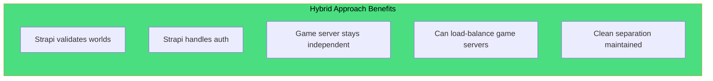

---

## Decision Matrix

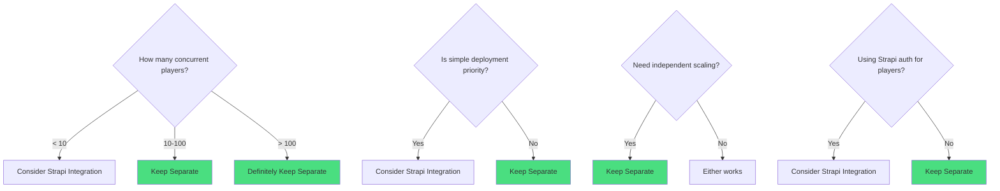

---

## Recommendation

### Keep Separate Servers (Current Approach) ✓

**For this project**, keeping them separate is the better choice:

1. **Clean separation of concerns** - Game logic stays in game server, CMS stays in Strapi
2. **Independent scaling** - Can add more game servers without touching CMS
3. **Easier debugging** - Game issues don't mix with Strapi issues
4. **Restart isolation** - Strapi restart doesn't kick players
5. **Future flexibility** - Can swap Strapi for another backend without touching game server

### When to Reconsider

Consider moving to Strapi if:
- Very low player counts (<10 concurrent)
- Strapi is already your main app server (not just CMS)
- You want to use Strapi's auth/permissions for players
- Simpler deployment is a higher priority than performance
- You're building a Strapi plugin for reuse

---

## Conclusion

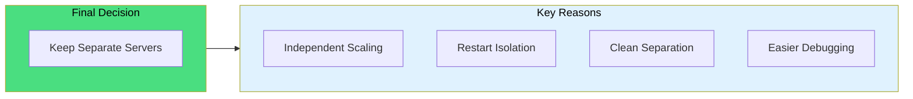

**Decision: Keep separate servers**

The current architecture with a separate WebSocket game server is the right choice for this project. The benefits of clean separation, independent scaling, and restart isolation outweigh the convenience of a single deployment.

If deployment simplicity becomes a priority later, consider the hybrid approach where Strapi validates connections but the game server remains separate.
